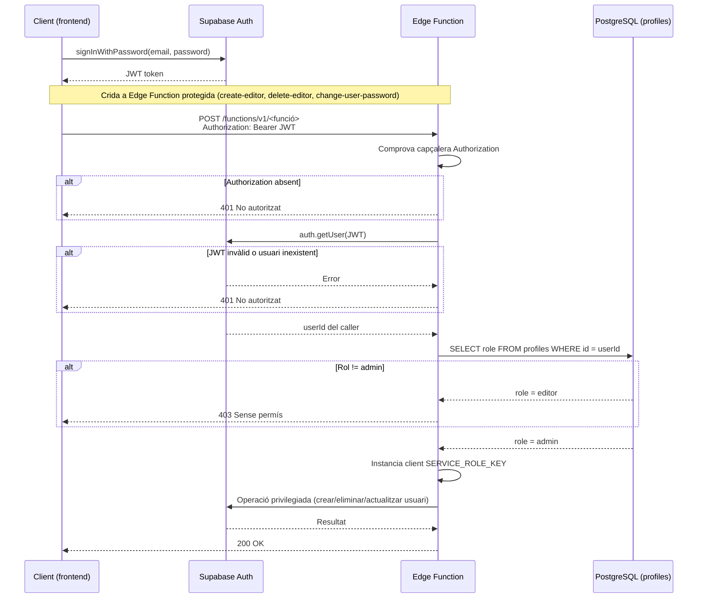
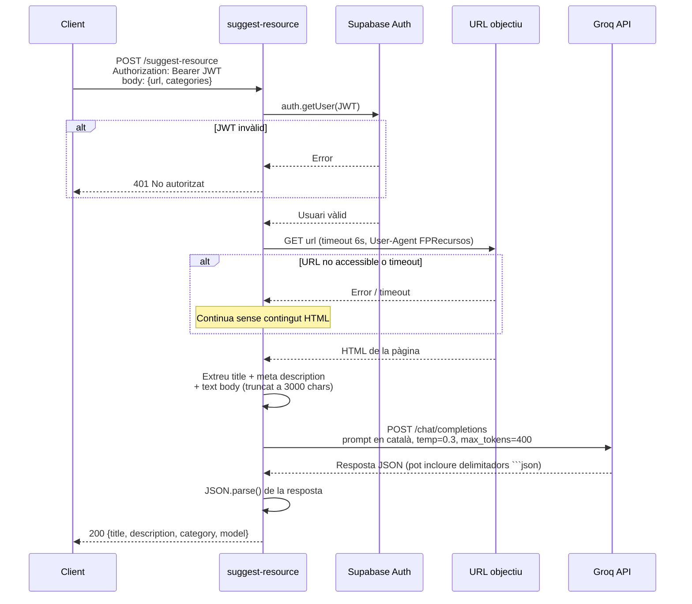
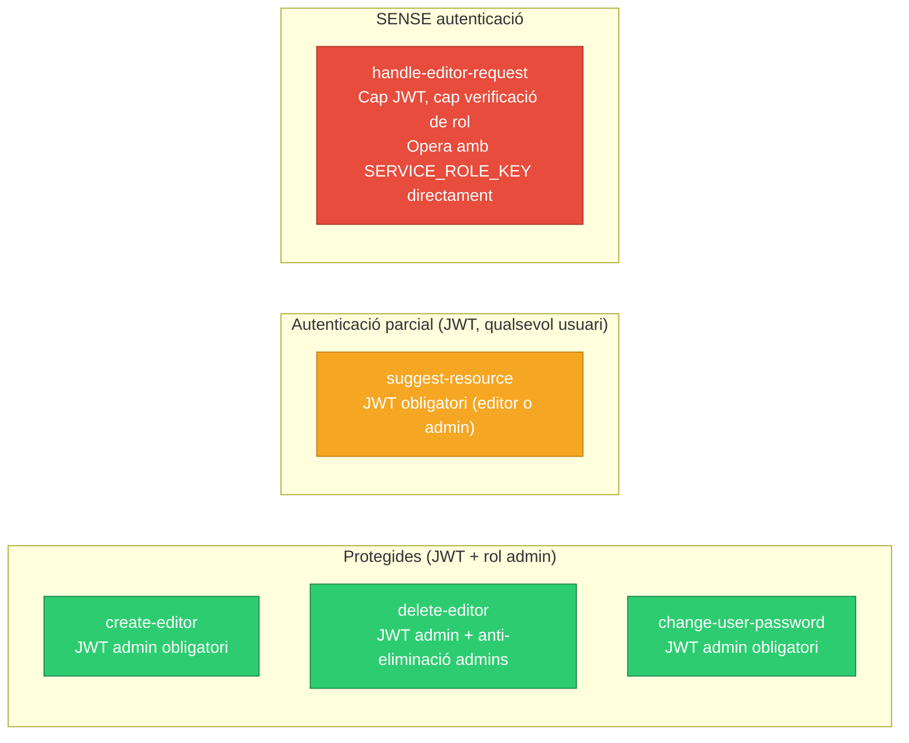

# Referència API — fp-recursos

**Versió**: 1.0  
**Data**: 2026-05-29  
**URL base de producció**: `https://fp-recursos.masellas.info`  
**URL base Edge Functions**: `https://<SUPABASE_PROJECT_REF>.supabase.co/functions/v1`  
**URL base API REST (dades)**: `https://<SUPABASE_PROJECT_REF>.supabase.co/rest/v1`  
**Runtime Edge Functions**: Deno (Supabase Edge Functions)  
**Client frontend**: `@supabase/supabase-js` v2

---

## Visió general

fp-recursos exposa dues capes d'API:

1. **Edge Functions** — 5 endpoints HTTP POST implementats com a funcions Deno. Gestionen operacions privilegiades: suggeriment de metadades per IA, gestió d'editors i canvis de contrasenya.
2. **API REST de Supabase** — accés directe a les taules de base de dades via `supabase-js`. Totes les operacions estan governades per polítiques Row-Level Security (RLS) a PostgreSQL.

---

## Autenticació

El diagrama següent mostra el flux d'autenticació complet per a una Edge Function amb JWT:



### JWT Bearer (sessió d'usuari)

El frontend obté un JWT via `supabase.auth.signInWithPassword()`. Aquest token s'envia com a capçalera HTTP en totes les peticions privilegiades:

```
Authorization: Bearer <jwt_token>
```

El client `supabase-js` afegeix aquesta capçalera automàticament quan s'invoca `supabase.functions.invoke()`. Per a crides HTTP directes, la capçalera s'ha d'afegir manualment.

Les Edge Functions validen el token creant un client Supabase amb la `SUPABASE_ANON_KEY` i el JWT del caller (`supabase.auth.getUser()`). Posteriorment consulten la taula `profiles` per verificar el `role`.

### Service Role (intern a Edge Functions)

Les funcions `create-editor`, `delete-editor` i `change-user-password` utilitzen la variable `SERVICE_ROLE_KEY` per instanciar un client privilegiat que opera sobre `auth.users` ignorant RLS.

La funció `handle-editor-request` utilitza `SUPABASE_SERVICE_ROLE_KEY` — nom diferent que les altres tres funcions (inconsistència documentada).

### CORS

Totes les Edge Functions configuren CORS obert:

```
Access-Control-Allow-Origin: *
Access-Control-Allow-Headers: authorization, x-client-info, apikey, content-type
```

Totes responen a preflight `OPTIONS` amb `200 OK` sense cos.

> **Nota de seguretat**: El CORS totalment obert augmenta la superfície d'atac. Es recomana restringir-lo al domini de producció `https://fp-recursos.masellas.info`.

### Format d'error comú

Totes les Edge Functions retornen errors en el mateix format:

```json
{ "error": "<missatge d'error>" }
```

Codis HTTP d'error: `400` (paràmetres absents), `401` (no autenticat), `403` (sense permís), `500` (error intern).

---

## Edge Functions

### POST /functions/v1/suggest-resource

**Descripció**: Suggereix títol, descripció i categoria per a un recurs educatiu. La funció obté el contingut HTML de la URL indicada, n'extreu el text, i crida la Groq API (model `llama-3.1-8b-instant`) per generar metadades en català.

**Autenticació**: Obligatòria. Qualsevol usuari autenticat (editor o admin) amb JWT vàlid.

**Capçaleres de petició**:
```
Authorization: Bearer <jwt_token>
Content-Type: application/json
```

**Cos de la petició**:
```json
{
  "url": "https://docs.python.org/3/",
  "categories": ["Programació", "Bases de dades", "Xarxes"]
}
```

| Camp | Tipus | Obligatori | Descripció |
|------|-------|-----------|-------------|
| `url` | string | Sí | URL del recurs a analitzar |
| `categories` | string[] | Sí (pot ser buit) | Llista de categories disponibles per a la classificació |

**Comportament intern**:

1. Valida presència de capçalera `Authorization` — retorna 401 si absent.
2. Valida el JWT contra Supabase — retorna 401 si l'usuari no existeix.
3. Fa fetch de la URL amb timeout de **6 segons** i `User-Agent: Mozilla/5.0 (compatible; FPRecursos/1.0)`.
4. Si el `Content-Type` de la resposta no conté `html`, tracta la pàgina com no disponible.
5. Extreu `<title>`, `<meta name="description">` i text del body (elimina scripts, styles, nav, header, footer; trunca a 3000 caràcters).
6. Construeix un prompt en català i crida Groq API amb `temperature: 0.3` i `max_tokens: 400`.
7. Fa `JSON.parse()` de la resposta de Groq (elimina possibles delimitadors markdown `` ```json ``).



**Resposta correcta (200)**:
```json
{
  "title": "Títol concís del recurs (màxim 80 caràcters)",
  "description": "Descripció de 2-3 frases en català",
  "category": "Programació",
  "model": "llama-3.1-8b-instant"
}
```

**Respostes d'error**:

| Codi HTTP | Cos | Condició |
|-----------|-----|----------|
| 401 | `{"error": "No autoritzat"}` | Capçalera Authorization absent |
| 401 | `{"error": "No autoritzat"}` | JWT invàlid o usuari inexistent |
| 500 | `{"error": "URL requerida"}` | Camp `url` absent al cos (retorna 500, no 400) |
| 500 | `{"error": "Groq error: <status>"}` | Groq API retorna error HTTP |
| 500 | `{"error": "<missatge>"}` | Error de parse JSON de la resposta Groq o altre error intern |

**Notes**:
- Si la URL no és accessible o fa timeout (6s), el prompt s'envia igualment però sense contingut de pàgina. Groq pot generar metadades basades únicament en la URL.
- L'extensió Chrome té un timeout addicional de **30 segons** per a la crida a aquesta funció (`AbortSignal.timeout(30_000)`); retorna `null` si es supera.
- No hi ha limitació de velocitat (rate limiting) a nivell d'aplicació. S'apliquen els límits de la plataforma Supabase.
- Variables d'entorn requerides: `GROQ_API_KEY`, `SUPABASE_URL`, `SUPABASE_ANON_KEY`.

**Exemple de crida directa**:
```bash
curl -X POST \
  https://<PROJECT_REF>.supabase.co/functions/v1/suggest-resource \
  -H "Authorization: Bearer <jwt_token>" \
  -H "Content-Type: application/json" \
  -d '{"url":"https://docs.python.org/3/","categories":["Programació","Xarxes"]}'
```

---

### POST /functions/v1/handle-editor-request

> **AVÍS CRÍTIC DE SEGURETAT**: Aquest endpoint **no valida cap JWT del caller**. No té autenticació pròpia. Qualsevol persona amb la URL de la funció pot invocar aprovacions, rebuigs o reactivacions d'editors sense cap credencial. La protecció actual és únicament operacional (la interfície d'usuari el crida des d'un component accessible només a admins), no tècnica a nivell d'API. Vegeu la secció de Seguretat per a la remediació recomanada.

**Descripció**: Gestiona accions sobre sol·licituds d'accés d'editor (`approve`, `reject`) i reactivació d'editors existents (`reactivate`). Envia notificacions per correu electrònic via Resend API.

**Autenticació**: Cap. La funció utilitza directament la `SUPABASE_SERVICE_ROLE_KEY`.

**Cos de la petició — acció `approve`**:
```json
{
  "action": "approve",
  "requestId": "550e8400-e29b-41d4-a716-446655440000",
  "email": "editor@exemple.com",
  "name": "Joan Garcia"
}
```

**Cos de la petició — acció `reject`**:
```json
{
  "action": "reject",
  "requestId": "550e8400-e29b-41d4-a716-446655440000",
  "email": "editor@exemple.com",
  "name": "Joan Garcia"
}
```

**Cos de la petició — acció `reactivate`**:
```json
{
  "action": "reactivate",
  "userId": "550e8400-e29b-41d4-a716-446655440001"
}
```

| Camp | Tipus | Obligatori per a | Descripció |
|------|-------|-----------------|-------------|
| `action` | `"approve"` \| `"reject"` \| `"reactivate"` | Totes | Acció a executar |
| `requestId` | string (UUID) | `approve`, `reject` | ID de la fila a `editor_requests` |
| `email` | string | `approve`, `reject` | Correu electrònic de l'usuari |
| `name` | string | `approve`, `reject` | Nom de l'usuari |
| `userId` | string (UUID) | `reactivate` | UUID d'`auth.users` de l'usuari a reactivar |

**Comportament per acció**:

**`approve` (usuari nou)**:
1. Invoca `supabaseAdmin.auth.admin.inviteUserByEmail` → Supabase envia correu d'invitació.
2. Actualitza `editor_requests.status = 'approved'` per `requestId`.

**`approve` (usuari existent — error 422)**:
1. Cerca l'usuari per email a `listUsers`.
2. Actualitza `profiles` a `active: true, role: 'editor'`.
3. Genera un link de recuperació de contrasenya via `generateLink`.
4. Envia email de reactivació via Resend (remitent: `noreply@masellas.info`).
5. Actualitza `editor_requests.status = 'approved'`.

**`reject`**:
1. Envia email de rebuig via Resend (remitent: `onboarding@resend.dev` — diferent del d'aprovació).
2. Actualitza `editor_requests.status = 'rejected'`.

**`reactivate`**:
1. Obté email i `username` de l'usuari via `getUserById(userId)`.
2. Genera link de recuperació de contrasenya.
3. Envia email de reactivació via Resend (remitent: `noreply@masellas.info`).
4. **No actualitza `profiles.active`** — la reactivació del perfil la fa el caller (`setUserActive`) abans d'invocar aquesta funció.

**Resposta correcta (200)**:
```json
{ "ok": true }
```

**Respostes d'error**:

| Codi HTTP | Cos | Condició |
|-----------|-----|----------|
| 500 | `{"error": "RESEND_API_KEY no configurada"}` | Variable d'entorn absent |
| 500 | `{"error": "Usuari amb email <e> no trobat a Auth"}` | Usuari no trobat durant aprovació de compte existent |
| 500 | `{"error": "Resend error: <body>"}` | Resend API retorna error HTTP |
| 500 | `{"error": "<missatge>"}` | Qualsevol altre error (no retorna mai 401 ni 403) |

**Notes**:
- El remitent del correu de rebuig (`onboarding@resend.dev`) és diferent del remitent d'aprovació i reactivació (`noreply@masellas.info`).
- L'acció `reactivate` falla amb error 500 si `userId` és absent (no hi ha guarda explícita).
- Variables d'entorn requerides: `SUPABASE_URL`, `SUPABASE_SERVICE_ROLE_KEY`, `RESEND_API_KEY`, `SITE_URL`.

---

### POST /functions/v1/create-editor

**Descripció**: Crea un nou usuari editor directament a `auth.users` amb email ja verificat. Reservat exclusivament per a administradors.

**Autenticació**: Obligatòria. JWT d'admin. La funció verifica explícitament que `profiles.role === 'admin'`.

**Capçaleres de petició**:
```
Authorization: Bearer <jwt_token>
Content-Type: application/json
```

**Cos de la petició**:
```json
{
  "email": "noueditor@exemple.com",
  "password": "contrasenya-segura",
  "username": "Maria Lopez"
}
```

| Camp | Tipus | Obligatori | Descripció |
|------|-------|-----------|-------------|
| `email` | string | Sí | Correu electrònic del nou editor |
| `password` | string | Sí | Contrasenya inicial |
| `username` | string | Sí | Nom visible a la plataforma |

**Comportament intern**:

1. Verifica presència de capçalera `Authorization` — 401 si absent.
2. Valida JWT i obté el caller — 401 si invàlid.
3. Consulta `profiles.role` del caller — 403 si no és `admin`.
4. Valida presència dels tres camps del cos — 400 si falta algun.
5. Crea l'usuari via `supabaseAdmin.auth.admin.createUser({ email, password, email_confirm: true, user_metadata: { username } })`.
6. El trigger `on_auth_user_created` crea automàticament la fila a `profiles` amb `role: 'editor'`.

**Resposta correcta (200)**:
```json
{
  "id": "uuid-del-nou-usuari",
  "email": "noueditor@exemple.com"
}
```

**Respostes d'error**:

| Codi HTTP | Cos | Condició |
|-----------|-----|----------|
| 401 | `{"error": "No autoritzat"}` | Capçalera Authorization absent o JWT invàlid |
| 403 | `{"error": "Només els administradors poden crear editors"}` | Caller no és admin |
| 400 | `{"error": "Email, contrasenya i nom d'usuari són obligatoris"}` | Falta algun dels tres camps |
| 500 | `{"error": "<missatge de Supabase Auth>"}` | Error de creació (email duplicat, etc.) |

**Notes**:
- Utilitza la variable `SERVICE_ROLE_KEY` (no `SUPABASE_SERVICE_ROLE_KEY`). Inconsistent amb `handle-editor-request` — tots dos secrets han d'estar configurats amb el mateix valor.
- Variables d'entorn requerides: `SUPABASE_URL`, `SUPABASE_ANON_KEY`, `SERVICE_ROLE_KEY`.

---

### POST /functions/v1/delete-editor

**Descripció**: Elimina permanentment un usuari de `auth.users`. L'eliminació en cascada suprimeix la fila a `profiles`. No es pot eliminar un usuari amb rol `admin`.

**Autenticació**: Obligatòria. JWT d'admin.

**Capçaleres de petició**:
```
Authorization: Bearer <jwt_token>
Content-Type: application/json
```

**Cos de la petició**:
```json
{
  "userId": "550e8400-e29b-41d4-a716-446655440000"
}
```

| Camp | Tipus | Obligatori | Descripció |
|------|-------|-----------|-------------|
| `userId` | string (UUID) | Sí | ID d'`auth.users` de l'editor a eliminar |

**Comportament intern**:

1. Verifica presència de capçalera `Authorization` — 401 si absent.
2. Valida JWT — 401 si invàlid.
3. Consulta `profiles.role` del caller — 403 si no és `admin`.
4. Valida presència de `userId` — 400 si absent.
5. Consulta `profiles.role` de l'usuari objectiu — 403 si el target és `admin`.
6. Elimina l'usuari via `supabaseAdmin.auth.admin.deleteUser(userId)`.

**Resposta correcta (200)**:
```json
{ "ok": true }
```

**Respostes d'error**:

| Codi HTTP | Cos | Condició |
|-----------|-----|----------|
| 401 | `{"error": "No autoritzat"}` | Capçalera Authorization absent o JWT invàlid |
| 403 | `{"error": "Només els administradors poden eliminar editors"}` | Caller no és admin |
| 400 | `{"error": "userId és obligatori"}` | Camp `userId` absent |
| 403 | `{"error": "No es pot eliminar un administrador"}` | L'usuari objectiu té rol `admin` |
| 500 | `{"error": "<missatge de Supabase Auth>"}` | Error d'eliminació |

**Notes**:
- Variables d'entorn requerides: `SUPABASE_URL`, `SUPABASE_ANON_KEY`, `SERVICE_ROLE_KEY`.

---

### POST /functions/v1/change-user-password

**Descripció**: Actualitza la contrasenya d'un usuari qualsevol identificat per UUID. Reservat exclusivament per a administradors.

**Autenticació**: Obligatòria. JWT d'admin.

**Capçaleres de petició**:
```
Authorization: Bearer <jwt_token>
Content-Type: application/json
```

**Cos de la petició**:
```json
{
  "userId": "550e8400-e29b-41d4-a716-446655440000",
  "password": "nova-contrasenya-segura"
}
```

| Camp | Tipus | Obligatori | Descripció |
|------|-------|-----------|-------------|
| `userId` | string (UUID) | Sí | ID d'`auth.users` de l'usuari |
| `password` | string | Sí | Nova contrasenya (sense restriccions de format al servidor) |

**Comportament intern**:

1. Verifica presència de capçalera `Authorization` — 401 si absent.
2. Valida JWT — 401 si invàlid.
3. Consulta `profiles.role` del caller — 403 si no és `admin`.
4. Valida presència de `userId` i `password` — 400 si falta algun.
5. Actualitza la contrasenya via `supabaseAdmin.auth.admin.updateUserById(userId, { password })`.

**Resposta correcta (200)**:
```json
{ "ok": true }
```

**Respostes d'error**:

| Codi HTTP | Cos | Condició |
|-----------|-----|----------|
| 401 | `{"error": "No autoritzat"}` | Capçalera Authorization absent o JWT invàlid |
| 403 | `{"error": "Només els administradors poden canviar contrasenyes"}` | Caller no és admin |
| 400 | `{"error": "userId i password són obligatoris"}` | Falta algun dels dos camps |
| 500 | `{"error": "<missatge de Supabase Auth>"}` | Error de Supabase Auth |

**Notes**:
- No hi ha cap restricció de longitud o complexitat de contrasenya a nivell de servidor.
- Variables d'entorn requerides: `SUPABASE_URL`, `SUPABASE_ANON_KEY`, `SERVICE_ROLE_KEY`.

---

## API REST de Supabase (accés directe a dades)

El frontend accedeix a les taules de base de dades directament via `supabase-js`, que internament fa peticions HTTP a l'API REST de Supabase (`/rest/v1/<taula>`). Totes les peticions inclouen la `SUPABASE_ANON_KEY` com a capçalera `apikey`. Les peticions autenticades afegeixen `Authorization: Bearer <jwt>`.

L'accés efectiu a les dades el determina la configuració **Row-Level Security (RLS)** de PostgreSQL, no la lògica d'aplicació.

---

### Taula: bookmarks

Fitxer de servei: `src/services/bookmarks.ts`

**Accessibilitat RLS**:

| Operació | Qui hi té accés |
|----------|----------------|
| SELECT | Tothom (públic, sense autenticació) |
| INSERT | Editor autenticat (propi `user_id`) |
| UPDATE | Editor (propi) o admin |
| DELETE | Editor (propi) o admin |

**Operacions implementades**:

| Funció | Descripció | Auth requerida |
|--------|-----------|----------------|
| `getBookmarks()` | Retorna tots els recursos amb JOIN a `profiles` (username, active). Ordenat per `highlighted DESC, created_at DESC` | No |
| `createBookmark(bookmark)` | Insereix un nou recurs | Sí (editor+) |
| `updateBookmark(id, updates)` | Actualitza camps del recurs | Sí (editor propi o admin) |
| `deleteBookmark(id)` | Elimina un recurs | Sí (editor propi o admin) |
| `toggleHighlight(id, highlighted)` | Commuta l'estat destacat global | Sí (admin) |
| `reassignCategory(oldName, newName)` | Reassigna recursos d'una categoria a una altra | Sí |

**Esquema de creació (`BookmarkInsert`)**:
```typescript
{
  title: string        // obligatori
  description: string  // obligatori
  url: string          // obligatori
  categories: string[] // obligatori, pot ser buit
  user_id: string      // UUID del propietari (ha de coincidir amb auth.uid())
  highlighted?: boolean // opcional, per defecte false
}
```

**Esquema d'actualització (`BookmarkUpdate`)**:
```typescript
{
  title?: string
  description?: string
  url?: string
  categories?: string[]
  highlighted?: boolean
  admin_reviewed?: boolean // columna afegida via dashboard, absent de la migració
}
```

**Esquema complet de la taula** (definit a `001_initial_schema.sql` + columna addicional via dashboard):
```sql
id           uuid PRIMARY KEY DEFAULT gen_random_uuid()
title        text NOT NULL
description  text NOT NULL
url          text NOT NULL
categories   text[]
user_id      uuid REFERENCES profiles(id)
highlighted  boolean DEFAULT false
created_at   timestamptz DEFAULT now()
updated_at   timestamptz DEFAULT now()
admin_reviewed boolean DEFAULT false  -- afegit via dashboard, absent de la migració
```

> **Nota**: La columna `admin_reviewed` existeix a la taula de producció però NO apareix al fitxer de migració `001_initial_schema.sql`. S'ha afegit manualment via el dashboard de Supabase. Cal crear-la manualment en qualsevol desplegament nou.

---

### Taula: categories

Fitxer de servei: `src/services/categories.ts`

**Accessibilitat RLS**:

| Operació | Qui hi té accés |
|----------|----------------|
| SELECT | Tothom (públic) |
| INSERT / UPDATE / DELETE | Només admin |

**Operacions implementades**:

| Funció | Descripció | Auth requerida |
|--------|-----------|----------------|
| `getCategories()` | Retorna totes les categories ordenades per `name ASC` | No |
| `createCategory(name, userId)` | Crea una nova categoria | Sí (admin — RLS) |
| `updateCategory(id, name)` | Canvia el nom d'una categoria | Sí (admin — RLS) |
| `deleteCategory(id)` | Elimina una categoria | Sí (admin — RLS) |

**Esquema de la taula**:
```sql
id         uuid PRIMARY KEY DEFAULT gen_random_uuid()
name       text NOT NULL UNIQUE
created_by uuid REFERENCES profiles(id)
created_at timestamptz DEFAULT now()
```

---

### Taula: profiles

Fitxer de servei: `src/services/profiles.ts`

**Accessibilitat RLS**:

| Operació | Qui hi té accés |
|----------|----------------|
| SELECT | Tothom (públic) |
| INSERT | Via trigger automàtic (no accessible directament) |
| UPDATE | Propi perfil (camp `username`); admin via Edge Functions |

**Operacions implementades**:

| Funció | Descripció | Auth requerida |
|--------|-----------|----------------|
| `getProfiles()` | Retorna tots els perfils (admin view) | Sí |
| `setUserActive(id, active)` | Activa/desactiva un editor | Sí (admin) |
| `updateProfile(id, username)` | Actualitza el nom d'usuari | Sí (propi perfil) |
| `getAdminId()` | Retorna l'UUID de l'admin | No |

**Esquema de la taula**:
```sql
id         uuid PRIMARY KEY REFERENCES auth.users(id) ON DELETE CASCADE
username   text NOT NULL
role       text NOT NULL DEFAULT 'editor' CHECK (role IN ('editor', 'admin'))
active     boolean NOT NULL DEFAULT true
created_at timestamptz DEFAULT now()
```

---

### Taula: messages

Fitxer de servei: `src/services/messages.ts`

> **Nota**: Aquesta taula **no** apareix al fitxer de migració `001_initial_schema.sql`. Va ser creada directament al dashboard de Supabase. Les polítiques RLS exactes no es poden verificar des del codi font.

**Operacions implementades**:

| Funció | Descripció |
|--------|-----------|
| `getThread(userAId, userBId)` | Retorna els missatges entre dos usuaris |
| `getAllAdminMessages(adminId)` | Retorna tots els fils on participa l'admin |
| `sendMessage(senderId, recipientId, content)` | Envia un missatge i notifica per WhatsApp (CallMeBot) |
| `markThreadAsRead(recipientId, senderId)` | Marca missatges com llegits |
| `updateMessage(id, content)` | Edita un missatge propi |
| `deleteMessage(id)` | Elimina un missatge propi |
| `getUnreadCount(recipientId)` | Retorna el compte de missatges no llegits |

**Esquema deduït del codi**:
```sql
id                uuid PRIMARY KEY
sender_id         uuid REFERENCES profiles(id)
recipient_id      uuid REFERENCES profiles(id)
content           text
read_by_recipient boolean
created_at        timestamptz
```

**Efecte secundari**: `sendMessage()` crida `notifyWhatsApp()` que fa fetch a `https://api.callmebot.com/whatsapp.php`. L'error es silencia (best-effort).

---

### Taula: editor_requests

Fitxer de servei: `src/services/editorRequests.ts`

> **Nota**: Aquesta taula **no** apareix al fitxer de migració. Va ser creada al dashboard de Supabase. Les polítiques RLS exactes no es poden verificar des del codi font.

**Operacions implementades**:

| Funció | Descripció | Auth requerida |
|--------|-----------|----------------|
| `submitEditorRequest(name, email, comment)` | Envia sol·licitud d'accés d'editor | No (pública) |
| `getEditorRequests()` | Retorna totes les sol·licituds | Sí (admin) |
| `getPendingEditorRequestCount()` | Compta sol·licituds pendents | Sí (admin) |
| `approveEditorRequest(requestId, email, name)` | Aprova via Edge Function | Sí (admin) |
| `rejectEditorRequest(requestId, email, name)` | Rebutja via Edge Function | Sí (admin) |

**Esquema deduït del codi**:
```sql
id          uuid PRIMARY KEY
name        text NOT NULL
email       text NOT NULL
comment     text
status      text CHECK (status IN ('pending', 'approved', 'rejected')) DEFAULT 'pending'
created_at  timestamptz
reviewed_at timestamptz
reviewed_by uuid REFERENCES profiles(id)
```

**Efecte secundari**: `submitEditorRequest()` envia notificació WhatsApp via CallMeBot.

---

### Taula: contact_requests

Fitxer de servei: `src/services/contacts.ts`

> **Nota**: Aquesta taula **no** apareix al fitxer de migració. Va ser creada al dashboard de Supabase. Les polítiques RLS exactes no es poden verificar des del codi font.

**Operacions implementades**:

| Funció | Descripció | Auth requerida |
|--------|-----------|----------------|
| `submitContact(name, email, message)` | Envia un missatge de contacte | No (pública) |
| `getContactRequests()` | Retorna tots els contactes | Sí (admin) |
| `getUnreadContactCount()` | Compta contactes no llegits | Sí (admin) |
| `markContactAsRead(id)` | Marca un contacte com llegit | Sí (admin) |

**Esquema deduït del codi**:
```sql
id         uuid PRIMARY KEY
name       text NOT NULL
email      text NOT NULL
message    text NOT NULL
created_at timestamptz
read       boolean DEFAULT false
```

**Efecte secundari**: `submitContact()` envia notificació WhatsApp via CallMeBot.

---

### Taula: editor_highlights

Fitxer de servei: `src/services/highlights.ts`

> **Nota**: Aquesta taula **no** apareix al fitxer de migració. Va ser creada al dashboard de Supabase. Les polítiques RLS exactes no es poden verificar des del codi font.

**Operacions implementades**:

| Funció | Descripció | Auth requerida |
|--------|-----------|----------------|
| `getEditorHighlights(userId)` | Retorna els IDs de recursos destacats per l'editor | Sí (editor) |
| `toggleEditorHighlight(userId, bookmarkId, on)` | Afegeix o elimina un recurs de la llista personal | Sí (editor) |

**Esquema deduït del codi**:
```sql
user_id     uuid REFERENCES profiles(id)
bookmark_id uuid REFERENCES bookmarks(id)
-- Clau primària composta presumiblement (user_id, bookmark_id)
```

---

## Integracions externes

### Groq API

| Paràmetre | Valor |
|-----------|-------|
| URL | `https://api.groq.com/openai/v1/chat/completions` |
| Model | `llama-3.1-8b-instant` |
| Temperature | 0.3 |
| Max tokens | 400 |
| Autenticació | `Authorization: Bearer <GROQ_API_KEY>` (secret Supabase) |
| Invocat des de | Edge Function `suggest-resource` |

### Resend API

| Paràmetre | Valor |
|-----------|-------|
| URL | `https://api.resend.com/emails` |
| Autenticació | `Authorization: Bearer <RESEND_API_KEY>` (secret Supabase) |
| Remitent aprovació/reactivació | `noreply@masellas.info` |
| Remitent rebuig | `onboarding@resend.dev` |
| Invocat des de | Edge Function `handle-editor-request` |

### CallMeBot WhatsApp

> **Avís de seguretat**: Les credencials de CallMeBot (`VITE_CALLMEBOT_PHONE`, `VITE_CALLMEBOT_APIKEY`) tenen prefix `VITE_` i s'incrustren literalment al bundle JavaScript del navegador. Qualsevol usuari pot inspeccionar el JS desplegat i extreure-les. Es recomana moure les notificacions WhatsApp a una Edge Function de servidor.

| Paràmetre | Valor |
|-----------|-------|
| URL | `https://api.callmebot.com/whatsapp.php` |
| Mode fetch | `no-cors` (la resposta no és llegida; entrega best-effort) |
| Invocat des de | Frontend (browser), no des d'Edge Functions |
| Disparadors | `sendMessage()`, `submitContact()`, `submitEditorRequest()` |

---

## Resum de seguretat de l'API

| Funció | Autenticació | Autorització | Observació |
|--------|-------------|-------------|-----------|
| `suggest-resource` | JWT (qualsevol usuari) | Cap rol | Correcte per al cas d'ús |
| `handle-editor-request` | **Cap** | **Cap** | VULNERABILITAT CRÍTICA |
| `create-editor` | JWT (admin) | Rol admin verificat | Correcte |
| `delete-editor` | JWT (admin) | Rol admin verificat; protecció anti-eliminació d'admins | Correcte |
| `change-user-password` | JWT (admin) | Rol admin verificat | Correcte |

El diagrama següent compara visualment el nivell de protecció de cada funció:



---

## Especificació OpenAPI 3.0

```yaml
openapi: 3.0.0
info:
  title: fp-recursos Edge Functions API
  version: 1.0.0
  description: |
    API de les Supabase Edge Functions del projecte fp-recursos.
    Biblioteca de recursos educatius per al mòdul SSCE0110 de Formació Professional.
servers:
  - url: https://{supabaseProjectRef}.supabase.co/functions/v1
    variables:
      supabaseProjectRef:
        description: Referència del projecte Supabase

components:
  securitySchemes:
    BearerAuth:
      type: http
      scheme: bearer
      bearerFormat: JWT
      description: JWT obtingut via supabase.auth.signInWithPassword()
  schemas:
    AISuggestion:
      type: object
      required: [title, description, category, model]
      properties:
        title:
          type: string
          maxLength: 80
        description:
          type: string
        category:
          type: string
        model:
          type: string
          example: llama-3.1-8b-instant
    CreatedUser:
      type: object
      required: [id, email]
      properties:
        id:
          type: string
          format: uuid
        email:
          type: string
          format: email
    SuccessResponse:
      type: object
      properties:
        ok:
          type: boolean
          example: true
    ErrorResponse:
      type: object
      properties:
        error:
          type: string

paths:
  /suggest-resource:
    post:
      summary: Suggerir metadades de recurs via IA
      security:
        - BearerAuth: []
      requestBody:
        required: true
        content:
          application/json:
            schema:
              type: object
              required: [url, categories]
              properties:
                url:
                  type: string
                  format: uri
                categories:
                  type: array
                  items:
                    type: string
      responses:
        '200':
          content:
            application/json:
              schema:
                $ref: '#/components/schemas/AISuggestion'
        '401':
          content:
            application/json:
              schema:
                $ref: '#/components/schemas/ErrorResponse'
        '500':
          content:
            application/json:
              schema:
                $ref: '#/components/schemas/ErrorResponse'

  /handle-editor-request:
    post:
      summary: "Gestionar sol·licitud d'editor — SENSE AUTENTICACIÓ"
      requestBody:
        required: true
        content:
          application/json:
            schema:
              type: object
              required: [action]
              properties:
                action:
                  type: string
                  enum: [approve, reject, reactivate]
                requestId:
                  type: string
                  format: uuid
                email:
                  type: string
                  format: email
                name:
                  type: string
                userId:
                  type: string
                  format: uuid
      responses:
        '200':
          content:
            application/json:
              schema:
                $ref: '#/components/schemas/SuccessResponse'
        '500':
          content:
            application/json:
              schema:
                $ref: '#/components/schemas/ErrorResponse'

  /create-editor:
    post:
      summary: Crear nou editor (admin only)
      security:
        - BearerAuth: []
      requestBody:
        required: true
        content:
          application/json:
            schema:
              type: object
              required: [email, password, username]
              properties:
                email:
                  type: string
                  format: email
                password:
                  type: string
                username:
                  type: string
      responses:
        '200':
          content:
            application/json:
              schema:
                $ref: '#/components/schemas/CreatedUser'
        '400':
          content:
            application/json:
              schema:
                $ref: '#/components/schemas/ErrorResponse'
        '401':
          content:
            application/json:
              schema:
                $ref: '#/components/schemas/ErrorResponse'
        '403':
          content:
            application/json:
              schema:
                $ref: '#/components/schemas/ErrorResponse'

  /delete-editor:
    post:
      summary: Eliminar editor (admin only)
      security:
        - BearerAuth: []
      requestBody:
        required: true
        content:
          application/json:
            schema:
              type: object
              required: [userId]
              properties:
                userId:
                  type: string
                  format: uuid
      responses:
        '200':
          content:
            application/json:
              schema:
                $ref: '#/components/schemas/SuccessResponse'
        '400':
          content:
            application/json:
              schema:
                $ref: '#/components/schemas/ErrorResponse'
        '401':
          content:
            application/json:
              schema:
                $ref: '#/components/schemas/ErrorResponse'
        '403':
          content:
            application/json:
              schema:
                $ref: '#/components/schemas/ErrorResponse'

  /change-user-password:
    post:
      summary: Canviar contrasenya (admin only)
      security:
        - BearerAuth: []
      requestBody:
        required: true
        content:
          application/json:
            schema:
              type: object
              required: [userId, password]
              properties:
                userId:
                  type: string
                  format: uuid
                password:
                  type: string
      responses:
        '200':
          content:
            application/json:
              schema:
                $ref: '#/components/schemas/SuccessResponse'
        '400':
          content:
            application/json:
              schema:
                $ref: '#/components/schemas/ErrorResponse'
        '401':
          content:
            application/json:
              schema:
                $ref: '#/components/schemas/ErrorResponse'
        '403':
          content:
            application/json:
              schema:
                $ref: '#/components/schemas/ErrorResponse'
```

---

## Problemes de l'API documentats

Els problemes següents existeixen a la implementació actual i estan documentats aquí per a referència dels desenvolupadors:

1. **`handle-editor-request` sense autenticació**: Accessible per qualsevol petició POST sense JWT. Vegeu la secció "AVÍS CRÍTIC" a la descripció de l'endpoint.

2. **Inconsistència de noms de secrets**: `handle-editor-request` usa `SUPABASE_SERVICE_ROLE_KEY`; les altres tres funcions admin usen `SERVICE_ROLE_KEY`. Tots dos secrets han d'estar configurats amb el mateix valor al projecte Supabase.

3. **Codi HTTP incorrecte**: `suggest-resource` retorna HTTP 500 per a "URL requerida" (hauria de ser 400).

4. **`handle-editor-request` — `reactivate` sense guarda**: Si `userId` és absent, la funció retorna 500 amb un missatge poc descriptiu en lloc d'un 400 explícit.

5. **`admin_reviewed` fora de la migració**: El camp existeix a producció però no al fitxer de migració. Cal crear-lo manualment en desplegaments nous.

6. **Quatre taules sense migració**: `messages`, `editor_requests`, `contact_requests` i `editor_highlights` s'han creat directament al dashboard. Les seves polítiques RLS no es poden auditar des del codi font.
