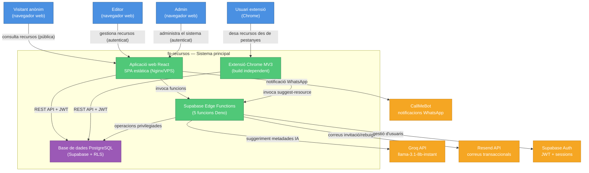
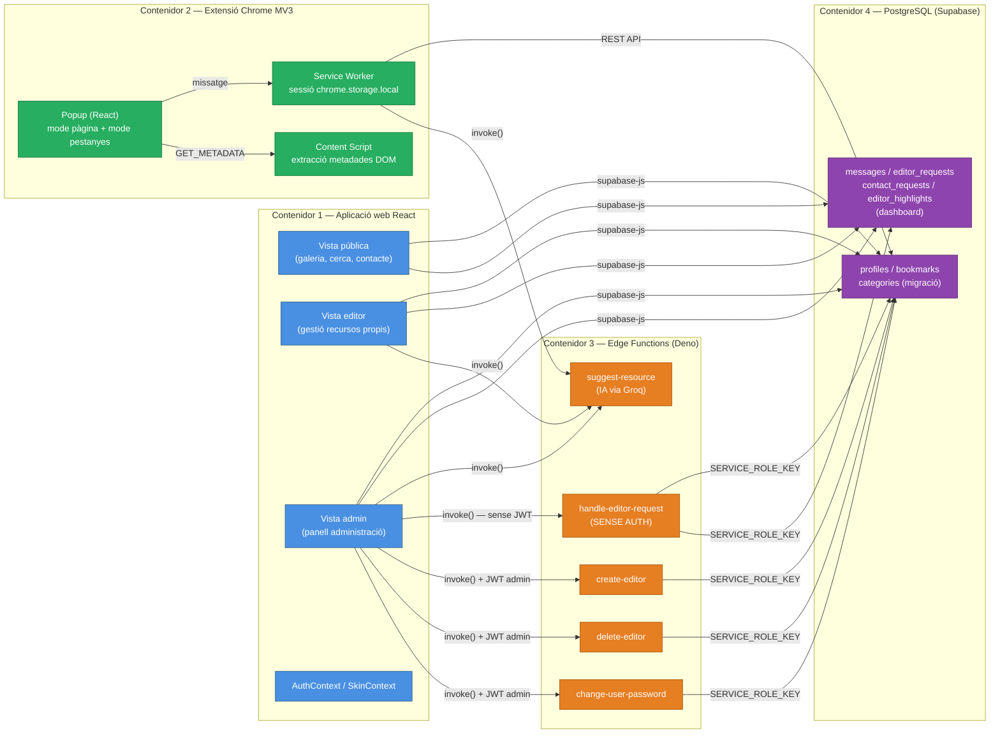
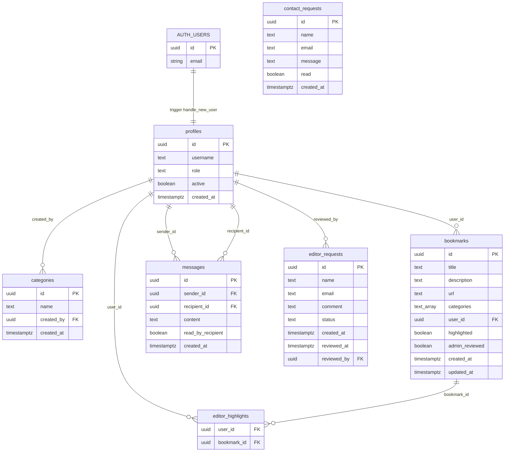
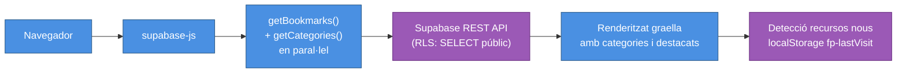
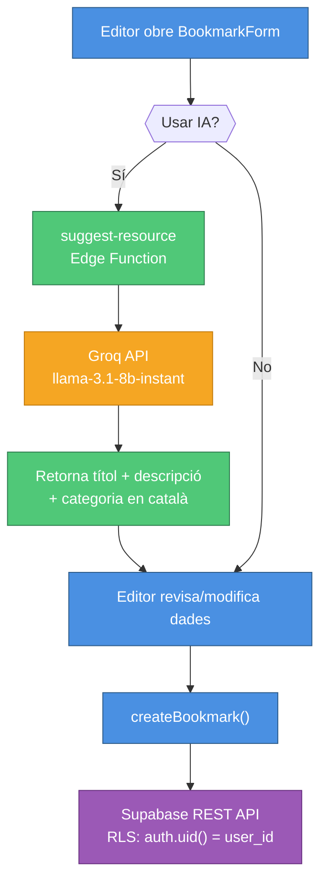
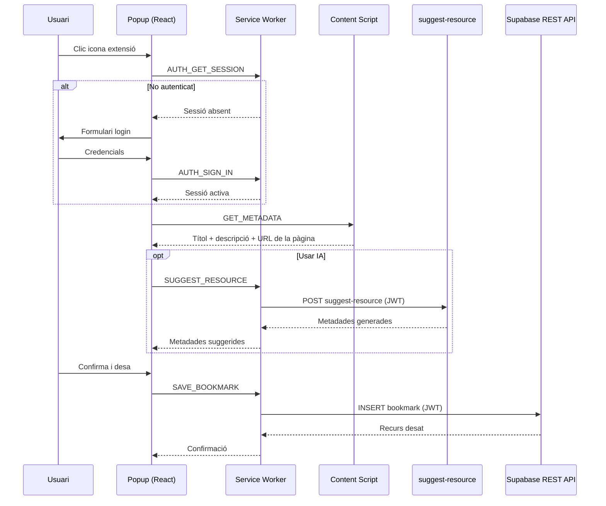
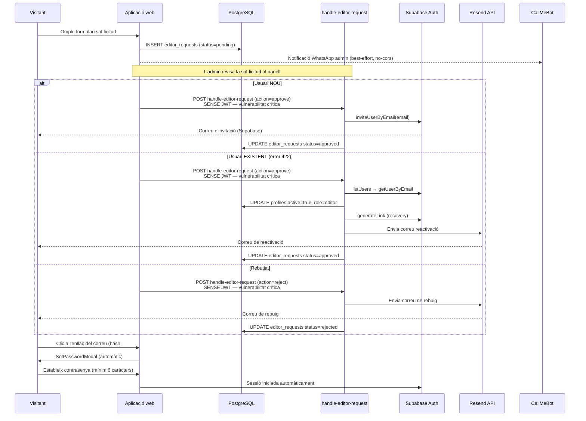
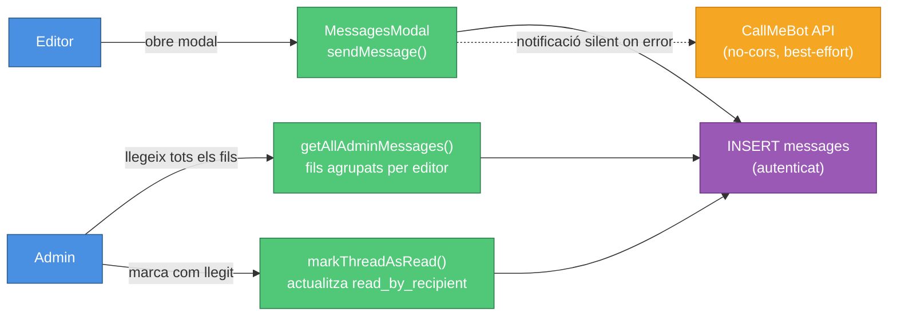
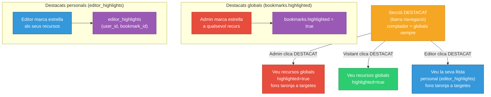

# Visió general d'arquitectura — fp-recursos

**Versió**: 1.0  
**Data**: 2026-05-29

---

## Propòsit del sistema

fp-recursos és una biblioteca curada de recursos web per a docents de Formació Professional (mòdul SSCE0110). El sistema permet als editors afegir i gestionar recursos; el públic pot consultar-los sense registrar-se. L'accés d'editors és controlat per un flux d'aprovació manual gestionat per l'admin.

---

## Visió de conjunt

El sistema és una aplicació de pàgina única (SPA) sense renderització al servidor. Tota la lògica de backend s'executa en dues capes: la base de dades PostgreSQL (via RLS i triggers) i les funcions Edge de Supabase (Deno). No existeix cap servidor d'aplicació intermedi.

El diagrama següent mostra el context del sistema fp-recursos i les seves relacions amb usuaris i serveis externs:



---

## Usuaris i rols

| Rol | Descripció |
|-----|------------|
| **Visitant anònim** | Accés de lectura a tots els recursos i categories sense autenticació |
| **Editor** (`role: 'editor'`) | Pot crear/editar/eliminar els seus propis recursos, gestionar categories, missatjar l'admin, mantenir destacats personals |
| **Admin** (`role: 'admin'`) | Totes les capacitats d'editor + gestió global de recursos, usuaris, sol·licituds i exportació |
| **Usuari d'extensió** | Subconjunt d'editors/admins que usa l'extensió Chrome per desar recursos directament des del navegador |

---

## Contenidors principals

El sistema es compon de quatre contenidors independents:

### Contenidor 1 — Aplicació web React (`src/`)

Aplicació React 19 de pàgina única (SPA) que serveix tres vistes lògiques:
- **Vista pública**: galeria de recursos, cerca, contacte, sol·licitud d'accés
- **Vista editor**: gestió de recursos propis, categories, missatgeria
- **Vista admin**: panell d'usuaris, sol·licituds, contactes, gestió global

La navegació entre vistes es gestiona via una variable d'estat React (`view: 'public' | 'editor' | 'admin'`). No s'utilitza cap biblioteca de router de client. El build genera fitxers estàtics desplegats a un VPS via FTP, servits per Nginx.

### Contenidor 2 — Extensió Chrome MV3 (`extension/`)

Extensió Chrome Manifest V3 amb sistema de build propi (Vite, package.json separat). Té tres scripts diferenciats:

- **Service worker** (`background/service-worker.ts`): gestiona totes les crides a Supabase API i conserva la sessió a `chrome.storage.local`. Respon a 9 tipus de missatge des del popup.
- **Content script** (`content/content.ts`): injectat a cada pàgina; extreu metadades del DOM (títol, descripció, URL) i respon al missatge `GET_METADATA`.
- **Popup** (`popup/popup.tsx`): interfície React en dos modes: mode pàgina única (desa la pestanya actual) i mode gestor de pestanyes (llista totes les pestanyes obertes, categorització en massa, desament en bloc).

La sessió de l'extensió és **independent** de la sessió de l'aplicació web. Un editor pot estar autenticat a un però no a l'altre.

### Contenidor 3 — Supabase Edge Functions (`supabase/functions/`)

Cinc funcions HTTP Deno desplegades al runtime de Supabase. Gestionen operacions que requereixen privilegis o serveis externs no accessibles directament des del client:

| Funció | Propòsit |
|--------|---------|
| `suggest-resource` | Suggeriment de metadades via IA (Groq/Llama-3.1) |
| `handle-editor-request` | Aprovació/rebuig de sol·licituds d'editor i reactivació d'editors (veure avís de seguretat) |
| `create-editor` | Creació directa d'editor per l'admin |
| `delete-editor` | Eliminació permanent d'editor |
| `change-user-password` | Canvi de contrasenya d'un usuari per l'admin |

El diagrama següent mostra els quatre contenidors i els seus components interns:



### Contenidor 4 — Base de dades PostgreSQL (Supabase)

Base de dades PostgreSQL gestionada per Supabase amb 7 taules. L'accés a les dades el controla **Row-Level Security (RLS)** a nivell de base de dades. Dos triggers automatitzen operacions:

- `handle_new_user`: crea automàticament una fila a `profiles` quan es crea un nou usuari a `auth.users`
- `handle_updated_at`: actualitza `bookmarks.updated_at` en cada modificació

---

## Esquema de la base de dades

El diagrama següent mostra les relacions entre les 7 taules de la base de dades:



### Taules definides a la migració (`001_initial_schema.sql`)

```
profiles
  id         uuid PK → auth.users
  username   text NOT NULL
  role       text ('editor'|'admin') DEFAULT 'editor'
  active     boolean DEFAULT true
  created_at timestamptz

categories
  id         uuid PK
  name       text UNIQUE NOT NULL
  created_by uuid → profiles
  created_at timestamptz

bookmarks
  id             uuid PK
  title          text NOT NULL
  description    text NOT NULL
  url            text NOT NULL
  categories     text[]
  user_id        uuid → profiles
  highlighted    boolean DEFAULT false
  created_at     timestamptz
  updated_at     timestamptz
  admin_reviewed boolean DEFAULT false  ← columna afegida via dashboard (absent de la migració)
```

### Taules creades al dashboard (sense migració)

> **Avís**: Les quatre taules següents i la columna `admin_reviewed` **no apareixen al fitxer de migració del repositori**. Existeixen a la base de dades de producció però les seves polítiques RLS no es poden verificar des del codi font.

```
messages
  id                uuid PK
  sender_id         uuid → profiles
  recipient_id      uuid → profiles
  content           text
  read_by_recipient boolean
  created_at        timestamptz

editor_requests
  id          uuid PK
  name        text NOT NULL
  email       text NOT NULL
  comment     text
  status      text ('pending'|'approved'|'rejected')
  created_at  timestamptz
  reviewed_at timestamptz
  reviewed_by uuid → profiles

contact_requests
  id         uuid PK
  name       text NOT NULL
  email      text NOT NULL
  message    text NOT NULL
  created_at timestamptz
  read       boolean DEFAULT false

editor_highlights
  user_id     uuid → profiles
  bookmark_id uuid → bookmarks
  (clau primària composta presumiblement)
```

---

## Polítiques Row-Level Security (RLS)

### Polítiques verificades a la migració

| Taula | SELECT | INSERT | UPDATE | DELETE |
|-------|--------|--------|--------|--------|
| `profiles` | Tothom | Via trigger (automàtic) | Propi row (`auth.uid() = id`) | — |
| `categories` | Tothom | Admins | Admins | Admins |
| `bookmarks` | Tothom | Editor propi (`auth.uid() = user_id`) | Editor propi O admin | Editor propi O admin |

La comprovació d'admin usa subconsulta: `exists (select 1 from profiles where id = auth.uid() and role = 'admin')`.

### Polítiques no verificades (taules dashboard)

Les polítiques de `messages`, `editor_requests`, `contact_requests` i `editor_highlights` no estan al repositori. El comportament observat al codi:

- `messages`: editors llegeixen el seu propi fil; admin llegeix tots els fils on participa.
- `editor_requests`: INSERT anònim possible (sense autenticació). Admin llegeix totes les sol·licituds.
- `contact_requests`: INSERT anònim possible. Admin llegeix tots els contactes.
- `editor_highlights`: per usuari; sense visibilitat creuada observada.

---

## Model d'autenticació i autorització

### Autenticació web

Supabase Auth gestiona l'autenticació amb email i contrasenya. El client obté un JWT que s'emmagatzema a la sessió del navegador. `AuthContext.tsx` subscriu `onAuthStateChange` per actualitzar l'estat de sessió de manera reactiva.

Els rols (`isAdmin`, `isEditor`) es deriven de `profile.role` llegit de la taula `profiles`.

### Autenticació extensió Chrome

L'extensió gestiona la sessió de manera independent: el JWT s'emmagatzema a `chrome.storage.local` al service worker. Totes les crides a Supabase des de l'extensió passen pel service worker.

### Flux d'autorització a les Edge Functions

Les funcions `create-editor`, `delete-editor` i `change-user-password` segueixen el mateix patró de defensa en profunditat:

1. Exigeix capçalera `Authorization: Bearer <jwt>` (401 si absent)
2. Valida el JWT via `supabase.auth.getUser()` (401 si invàlid)
3. Consulta `profiles.role` del caller (403 si no és admin)
4. Instancia un segon client amb `SERVICE_ROLE_KEY` per a l'operació privilegiada

> **Excepció crítica**: `handle-editor-request` **no segueix aquest patró**. No llegeix la capçalera `Authorization`, no valida cap JWT i opera directament amb `SUPABASE_SERVICE_ROLE_KEY`. Veure la secció de Seguretat.

---

## Fluxos de dades principals

### 1. Consulta pública



### 2. Editor afegeix recurs (aplicació web)



### 3. Extensió Chrome desa un recurs



### 4. Flux d'aprovació d'editor

El diagrama següent mostra el flux complet d'aprovació d'un editor, des de la sol·licitud fins a l'accés al sistema:



### 5. Missatgeria editor-admin



---

## Sistema de temes visuals

L'aplicació implementa 5 temes visuals (skins) via atributs CSS:

| ID | Nom | Estil |
|----|-----|-------|
| `brutal` | Brutal | Neubrutalist taronja (defecte) |
| `pastel90s` | Pastels 90s | Rosa pastel |
| `wabi` | Wabi | Japonès verd |
| `cyber` | Cyber | Cyberpunk neó |
| `corp` | Corp | Corporatiu blau |

El `SkinContext` aplica l'atribut `data-skin="<id>"` a `document.documentElement`. El CSS usa selectores `[data-skin="<id>"]` per aplicar cada tema. La selecció es persisteix a `localStorage['fp-skin']` i és local al navegador (no es sincronitza entre dispositius).

---

## Sistema de destacats dual

El sistema té dos mecanismes de destacat independents:

**Destacats globals** (`bookmarks.highlighted`):
- Controlats per l'admin
- Visibles a la secció `DESTACAT` per a visitants anònims i per a l'admin
- Mostren fons taronja a les targetes de recurs per a l'admin

**Destacats personals** (`editor_highlights`):
- Per editor, emmagatzemats a la taula `editor_highlights`
- Visibles a la secció `DESTACAT` per a l'editor (no admin) autenticat
- Mostren fons taronja a les targetes de recurs quan l'editor consulta la galeria

El diagrama següent il·lustra com els dos mecanismes de destacat coexisteixen i quina vista obté cada rol:



> **Nota**: La secció `DESTACAT` a la barra de navegació sempre comptabilitza els destacats globals (`highlightedBookmarks.length`), independentment del rol del visitant. El contingut que es mostra en clicar-la depèn del rol.

---

## Integracions externes

| Servei | Propòsit | Des d'on s'invoca | Credencials |
|--------|---------|------------------|-------------|
| **Supabase** | BD, Auth, Edge Functions | Tota l'app + extensió | `VITE_SUPABASE_URL`, `VITE_SUPABASE_ANON_KEY` (frontend); secrets Supabase (funcions) |
| **Groq API** | Suggeriment de metadades via LLM | Edge Function `suggest-resource` | `GROQ_API_KEY` (secret Supabase) |
| **Resend** | Correus transaccionals (invitació, aprovació, rebuig) | Edge Function `handle-editor-request` | `RESEND_API_KEY` (secret Supabase) |
| **CallMeBot** | Notificacions WhatsApp a l'admin | Frontend (browser) — **no servidor** | `VITE_CALLMEBOT_PHONE`, `VITE_CALLMEBOT_APIKEY` (exposats al bundle) |

---

## Decisió arquitectònica: absència de router de client

L'aplicació no utilitza cap biblioteca de router de client (React Router, etc.). La navegació entre les tres vistes lògiques (pública, editor, admin) es gestiona via una variable d'estat React: `view: 'public' | 'editor' | 'admin'`. No hi ha cap comentari al codi que expliqui aquesta decisió. Amb únicament tres vistes de primer nivell, un router complet no era estrictament necessari en el moment del disseny original.

---

## Decisió arquitectònica: taules de base de dades al dashboard

Quatre taules (`messages`, `editor_requests`, `contact_requests`, `editor_highlights`) i la columna `admin_reviewed` de `bookmarks` van ser creades directament al dashboard de Supabase en lloc d'afegir-les al fitxer de migració. No hi ha cap documentació al repositori que expliqui aquesta decisió. Com a conseqüència:

- Les polítiques RLS d'aquestes taules no estan versionades
- Cal crear-les manualment en qualsevol desplegament nou
- L'auditoria de seguretat d'aquestes taules requereix accés al dashboard de Supabase

---

## Limitacions i deute tècnic documentat

| Àmbit | Descripció |
|-------|-----------|
| **Arquitectura frontend** | `App.tsx` (~1622 línies, ~62KB) conté tota la lògica de la vista pública. Hauria de separar-se en components de pàgina individuals |
| **Tests** | El directori `src/` no té tests. L'extensió Chrome té 4 fitxers de test amb Vitest |
| **Tipatge TypeScript** | `types/database.ts` cobreix únicament 3 taules amb tipatge complet. Les taules de dashboard (`messages`, `editor_requests`, `contact_requests`) usen interfícies independents. `editor_highlights` no té tipatge |
| **Paginació** | `getBookmarks()` recupera tots els recursos sense paginació |
| **CI/CD** | No existeix cap pipeline d'integració contínua. El desplegament és completament manual |
| **Monitoratge** | No hi ha integració amb cap servei de logging ni error tracking extern. Els errors de les Edge Functions apareixen únicament als logs del dashboard de Supabase |

---

## Estructura de directoris

```
fp-recursos/
├── src/                          # Aplicació web React
│   ├── components/               # Components UI compartits
│   │   ├── BookmarkCard.tsx
│   │   ├── BookmarkForm.tsx
│   │   ├── Header.tsx
│   │   ├── MessagesModal.tsx
│   │   ├── ContactModal.tsx
│   │   ├── ContactsAdminModal.tsx
│   │   ├── EditorRequestModal.tsx
│   │   ├── EditorRequestsAdminModal.tsx
│   │   ├── ProtectedRoute.tsx
│   │   ├── SetPasswordModal.tsx
│   │   ├── SkinPicker.tsx
│   │   ├── ScrollToTop.tsx
│   │   └── UI.tsx                # Primitives compartits (Button, Input, etc.)
│   ├── context/
│   │   ├── AuthContext.tsx        # Sessió, perfil, isAdmin, isEditor
│   │   └── SkinContext.tsx        # Tema actiu, persistència localStorage
│   ├── lib/
│   │   └── supabase.ts            # Instància client Supabase
│   ├── pages/
│   │   ├── EditorView.tsx
│   │   ├── AdminView.tsx
│   │   └── LoginPage.tsx
│   ├── services/                  # Capa d'accés a dades (supabase.from() wrappers)
│   │   ├── bookmarks.ts
│   │   ├── categories.ts
│   │   ├── profiles.ts
│   │   ├── messages.ts
│   │   ├── contacts.ts
│   │   ├── editorRequests.ts
│   │   ├── highlights.ts
│   │   └── ai.ts
│   ├── skins/
│   │   └── index.ts               # Metadades dels 5 temes
│   ├── types/
│   │   └── database.ts            # Tipus TypeScript (cobreix 3 taules)
│   ├── App.tsx                    # Component principal (~1622 línies)
│   └── main.tsx                   # Entry point: SkinProvider > AuthProvider > App
│
├── extension/                     # Extensió Chrome MV3 (build independent)
│   ├── background/
│   │   └── service-worker.ts      # 9 tipus de missatge; gestió sessió chrome.storage
│   ├── content/
│   │   └── content.ts             # Extracció metadades DOM
│   ├── popup/
│   │   └── popup.tsx              # UI React (mode pàgina + mode pestanyes)
│   ├── shared/
│   │   ├── api.ts                 # Crides Supabase REST + suggest-resource
│   │   ├── config.ts              # Constants hardcodejades (URL + anon key)
│   │   └── types.ts
│   ├── tests/                     # 4 fitxers Vitest
│   └── dist/                      # Build de l'extensió (commitejat)
│
├── supabase/
│   ├── functions/
│   │   ├── suggest-resource/
│   │   ├── handle-editor-request/
│   │   ├── create-editor/
│   │   ├── delete-editor/
│   │   └── change-user-password/
│   └── migrations/
│       └── 001_initial_schema.sql  # Única migració (3 taules + triggers + RLS)
│
├── public/                        # Estàtics públics
├── .env.example                   # Només VITE_SUPABASE_URL + VITE_SUPABASE_ANON_KEY
├── deploy-manual-steps.md         # Instruccions de desplegament (parcialment desactualitzades)
└── TODO.md                        # Llista de tasques del projecte
```

---

## Seguretat — resum d'arquitectura

Per a la guia completa de seguretat, consulteu el document de desplegament. A continuació el resum arquitectònic:

**Controls implementats correctament**:
- RLS a PostgreSQL per a `profiles`, `categories` i `bookmarks`
- Verificació de rol admin al servidor en 3 de 5 Edge Functions
- Protecció contra eliminació d'admins a `delete-editor`
- Missatge genèric al reset de contrasenya (evita enumeració d'usuaris)
- Renderitzat via React sense `dangerouslySetInnerHTML` (mitiga XSS a la UI)

**Vulnerabilitats arquitectòniques documentades**:

| Severitat | Descripció |
|-----------|-----------|
| CRÍTICA | `handle-editor-request` sense autenticació ni autorització. Opera amb service role sense validar cap JWT |
| ALTA | Credencials CallMeBot (`VITE_CALLMEBOT_PHONE`, `VITE_CALLMEBOT_APIKEY`) incloses al bundle JavaScript del navegador |
| ALTA | Injecció HTML possible als correus Resend via camps d'entrada d'usuari no escapats |
| MITJANA | SSRF parcial a `suggest-resource` (fetch de URL sense validació d'esquema/host) |
| MITJANA | CORS totalment obert (`*`) a totes les Edge Functions |
| BAIXA | Polítiques RLS de 4 taules no versionades al repositori |
