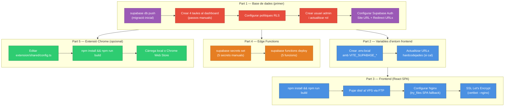
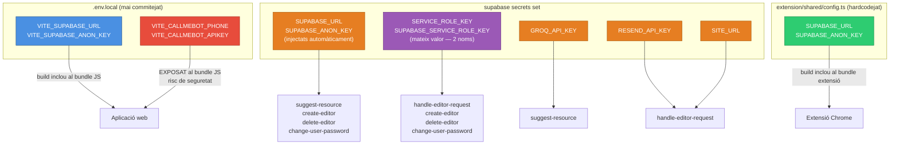

# Guia de desplegament — fp-recursos

**Versió**: 1.0  
**Data**: 2026-05-29

> **Advertència**: El desplegament és completament manual. No existeix cap pipeline de CI/CD. Cada pas s'ha d'executar a mà seguint aquest document.

---

## Requisits previs

Abans de començar, assegureu-vos de tenir accés a:

- Un projecte Supabase actiu (Free o Pro)
- Un VPS amb Nginx instal·lat i accés FTP
- Certificat SSL via Let's Encrypt (certbot)
- Claus d'API externes: Groq API, Resend API
- Supabase CLI instal·lat (`npm install -g supabase`)
- Node.js (per al build de l'aplicació web i l'extensió)
- (Opcional) Compte de CallMeBot configurat si voleu notificacions WhatsApp

---

## Visió general del procés

El desplegament té quatre components independents:

1. **Aplicació web** (frontend React) → VPS via FTP
2. **Edge Functions** (5 funcions Deno) → Supabase CLI
3. **Base de dades** → Supabase (migració + passos manuals)
4. **Extensió Chrome** → Chrome Web Store o càrrega local

El diagrama següent mostra els quatre components del desplegament i el seu ordre de dependència:



---

## Part 1: Configuració de la base de dades

### 1.1 Executar la migració inicial

```bash
# Enllaçar el projecte local amb el projecte Supabase
supabase login
supabase link --project-ref <project-id>

# Aplicar la migració
supabase db push
```

Això executa `supabase/migrations/001_initial_schema.sql`, que crea:
- Taules `profiles`, `categories`, `bookmarks`
- Triggers `handle_new_user` i `handle_updated_at`
- Polítiques RLS per a les tres taules

### 1.2 Crear les taules que falten a la migració

> **Important**: Les quatre taules següents i una columna addicional **no estan al fitxer de migració** i s'han de crear manualment al dashboard de Supabase (SQL Editor o Table Editor).

Accediu a Supabase Dashboard → SQL Editor i executeu:

```sql
-- Taula de missatges editor-admin
CREATE TABLE messages (
  id                uuid PRIMARY KEY DEFAULT gen_random_uuid(),
  sender_id         uuid REFERENCES profiles(id),
  recipient_id      uuid REFERENCES profiles(id),
  content           text NOT NULL,
  read_by_recipient boolean DEFAULT false,
  created_at        timestamptz DEFAULT now()
);

-- Taula de sol·licituds d'accés d'editor
CREATE TABLE editor_requests (
  id          uuid PRIMARY KEY DEFAULT gen_random_uuid(),
  name        text NOT NULL,
  email       text NOT NULL,
  comment     text,
  status      text CHECK (status IN ('pending', 'approved', 'rejected')) DEFAULT 'pending',
  created_at  timestamptz DEFAULT now(),
  reviewed_at timestamptz,
  reviewed_by uuid REFERENCES profiles(id)
);

-- Taula de contactes públics
CREATE TABLE contact_requests (
  id         uuid PRIMARY KEY DEFAULT gen_random_uuid(),
  name       text NOT NULL,
  email      text NOT NULL,
  message    text NOT NULL,
  created_at timestamptz DEFAULT now(),
  read       boolean DEFAULT false
);

-- Taula de destacats personals d'editors
CREATE TABLE editor_highlights (
  user_id     uuid REFERENCES profiles(id),
  bookmark_id uuid REFERENCES bookmarks(id),
  PRIMARY KEY (user_id, bookmark_id)
);

-- Columna admin_reviewed a bookmarks (absent de la migració)
ALTER TABLE bookmarks ADD COLUMN admin_reviewed boolean DEFAULT false;
```

### 1.3 Configurar les polítiques RLS de les taules noves

> **Avís de seguretat**: Les polítiques exactes de producció no estan documentades al repositori. Les polítiques que es mostren a continuació s'han deduït del comportament del codi. Verifiqueu-les i ajusteu-les segons les vostres necessitats de seguretat abans de posar en producció.

```sql
-- Activar RLS
ALTER TABLE messages ENABLE ROW LEVEL SECURITY;
ALTER TABLE editor_requests ENABLE ROW LEVEL SECURITY;
ALTER TABLE contact_requests ENABLE ROW LEVEL SECURITY;
ALTER TABLE editor_highlights ENABLE ROW LEVEL SECURITY;

-- Polítiques de messages
-- Editors: llegir el seu propi fil
CREATE POLICY "Users can read own thread" ON messages
  FOR SELECT USING (
    auth.uid() = sender_id OR auth.uid() = recipient_id
  );
-- Usuaris autenticats: inserir missatges
CREATE POLICY "Authenticated users can send messages" ON messages
  FOR INSERT WITH CHECK (auth.uid() = sender_id);
-- Usuaris: modificar/eliminar els seus propis missatges
CREATE POLICY "Users can modify own messages" ON messages
  FOR UPDATE USING (auth.uid() = sender_id);
CREATE POLICY "Users can delete own messages" ON messages
  FOR DELETE USING (auth.uid() = sender_id);

-- Polítiques de editor_requests
-- Inserció pública (sense autenticació)
CREATE POLICY "Anyone can submit editor request" ON editor_requests
  FOR INSERT WITH CHECK (true);
-- Admin: llegir i actualitzar totes
CREATE POLICY "Admin can read all requests" ON editor_requests
  FOR SELECT USING (
    EXISTS (SELECT 1 FROM profiles WHERE id = auth.uid() AND role = 'admin')
  );
CREATE POLICY "Admin can update requests" ON editor_requests
  FOR UPDATE USING (
    EXISTS (SELECT 1 FROM profiles WHERE id = auth.uid() AND role = 'admin')
  );

-- Polítiques de contact_requests
-- Inserció pública
CREATE POLICY "Anyone can submit contact" ON contact_requests
  FOR INSERT WITH CHECK (true);
-- Admin: llegir i actualitzar totes
CREATE POLICY "Admin can read contacts" ON contact_requests
  FOR SELECT USING (
    EXISTS (SELECT 1 FROM profiles WHERE id = auth.uid() AND role = 'admin')
  );
CREATE POLICY "Admin can mark contacts read" ON contact_requests
  FOR UPDATE USING (
    EXISTS (SELECT 1 FROM profiles WHERE id = auth.uid() AND role = 'admin')
  );

-- Polítiques de editor_highlights
-- Cada editor llegeix i gestiona els seus propis destacats
CREATE POLICY "Users can manage own highlights" ON editor_highlights
  FOR ALL USING (auth.uid() = user_id);
```

### 1.4 Crear el primer usuari admin

El trigger `handle_new_user` crea perfils amb `role: 'editor'` per defecte. Per a l'admin, cal crear l'usuari i actualitzar el rol manualment:

```sql
-- Primer: crear l'usuari des del dashboard Supabase Auth → Users → Invite user
-- Després d'acceptar la invitació, actualitzar el rol:
UPDATE profiles SET role = 'admin' WHERE id = '<uuid-del-usuari>';
```

### 1.5 Configurar Supabase Auth (dashboard)

Al dashboard de Supabase → Authentication → URL Configuration:

- **Site URL**: `https://fp-recursos.masellas.info` (o el vostre domini)
- **Additional Redirect URLs**: afegir `https://fp-recursos.masellas.info`

Sense aquesta configuració, els enllaços d'invitació i recuperació de contrasenya no redirigiran correctament.

---

## Part 2: Variables d'entorn del frontend

### 2.1 Crear el fitxer d'entorn

Copieu `.env.example` i completeu-lo:

```bash
cp .env.example .env.local
```

Editeu `.env.local`:

```env
# Obligatoris
VITE_SUPABASE_URL=https://xxxxxxxxxxxx.supabase.co
VITE_SUPABASE_ANON_KEY=<la-vostra-clau-anon-de-supabase>

# Opcionals — notificacions WhatsApp a l'admin
# AVÍS DE SEGURETAT: aquestes variables s'inclouen al bundle JavaScript
# del navegador i qualsevol persona pot llegir-les. Es recomana moure
# les notificacions a una Edge Function per a producció.
VITE_CALLMEBOT_PHONE=34612345678
VITE_CALLMEBOT_APIKEY=<la-vostra-api-key-de-callmebot>
```

> **Nota**: `.env.example` del repositori només inclou `VITE_SUPABASE_URL` i `VITE_SUPABASE_ANON_KEY`. Les variables de CallMeBot no estan documentades a `.env.example` però el codi les usa si estan presents.

### 2.2 URLs hardcodejades que cal canviar

Si desplegeu a un domini diferent de `fp-recursos.masellas.info`, modifiqueu:

**`src/pages/LoginPage.tsx` línia 38**:
```typescript
// Canvieu el domini al vostre:
redirectTo: 'https://el-vostre-domini.com'
```

**`supabase/functions/handle-editor-request/index.ts` línia 99** (cosmètic, no funcional):
```typescript
// HTML de l'email que conté una URL hardcodejada:
// href="https://fp-recursos.masellas.info/"
// Canvieu-la si voleu que l'email mostri el vostre domini
```

---

## Part 3: Build i desplegament del frontend

### 3.1 Construir l'aplicació

```bash
# Instal·lar dependències
npm install

# Construir per a producció
npm run build
```

El build genera la carpeta `dist/` amb tots els fitxers estàtics.

### 3.2 Pujar al VPS via FTP

Pugeu el contingut de `dist/` (no la carpeta `dist` en si, sinó el contingut interior) a:
```
/home/masellas-fp-recursos/htdocs/fp-recursos.masellas.info/
```

(Ajusteu el camí al vostre VPS.)

### 3.3 Configuració Nginx

Nginx ha de servir la SPA amb fallback a `index.html` per a totes les rutes (necessari per a la navegació client-side):

```nginx
server {
    listen 80;
    server_name fp-recursos.masellas.info;
    root /home/masellas-fp-recursos/htdocs/fp-recursos.masellas.info;
    index index.html;

    location / {
        try_files $uri $uri/ /index.html;
    }
}
```

### 3.4 SSL amb Let's Encrypt

```bash
certbot --nginx -d fp-recursos.masellas.info
```

Certbot modifica automàticament la configuració Nginx per afegir HTTPS i la renovació automàtica.

### 3.5 Verificació del frontend

Obriu `https://fp-recursos.masellas.info` al navegador. Hauríeu de veure la galeria pública. Si veieu un error 404, reviseu la configuració `try_files` de Nginx.

---

## Part 4: Desplegament de les Edge Functions

### 4.1 Configurar els secrets de Supabase

```bash
# Secrets que cal configurar manualment
supabase secrets set SERVICE_ROLE_KEY=<la-vostra-service-role-key>
supabase secrets set SUPABASE_SERVICE_ROLE_KEY=<la-mateixa-service-role-key>
supabase secrets set SITE_URL=https://fp-recursos.masellas.info
supabase secrets set GROQ_API_KEY=<la-vostra-clau-de-groq>
supabase secrets set RESEND_API_KEY=<la-vostra-clau-de-resend>
```

> **Important**: `SERVICE_ROLE_KEY` i `SUPABASE_SERVICE_ROLE_KEY` han de tenir el **mateix valor** (la service role key del projecte Supabase). Existeixen amb noms diferents per una inconsistència al codi entre funcions. Si es configura només un d'ells, almenys una funció fallarà.

Secrets injectats automàticament per Supabase (no cal configurar-los manualment):
- `SUPABASE_URL`
- `SUPABASE_ANON_KEY`

### 4.2 Verificar els secrets configurats

```bash
supabase secrets list
```

Comproveu que apareixen: `SERVICE_ROLE_KEY`, `SUPABASE_SERVICE_ROLE_KEY`, `SITE_URL`, `GROQ_API_KEY`, `RESEND_API_KEY`.

### 4.3 Desplegar les 5 Edge Functions

Cada funció s'ha de desplegar amb una comanda separada:

```bash
supabase functions deploy suggest-resource
supabase functions deploy handle-editor-request
supabase functions deploy create-editor
supabase functions deploy delete-editor
supabase functions deploy change-user-password
```

> **Nota**: El fitxer `deploy-manual-steps.md` del repositori només desplega 2 funcions i fa referència a `GEMINI_API_KEY` (incorrecte; el nom actual és `GROQ_API_KEY`). Seguiu les comandes d'aquest document, no les del `deploy-manual-steps.md`.

### 4.4 Verificar les Edge Functions

Al dashboard de Supabase → Edge Functions, hauríeu de veure les 5 funcions amb estat "Active".

Podeu provar `suggest-resource` (necessita un JWT vàlid):

```bash
curl -X POST \
  https://<PROJECT_REF>.supabase.co/functions/v1/suggest-resource \
  -H "Authorization: Bearer <jwt-d'un-editor>" \
  -H "Content-Type: application/json" \
  -d '{"url":"https://docs.python.org/3/","categories":["Programació"]}'
```

---

## Part 5: Extensió Chrome (opcional)

L'extensió Chrome és independent de l'aplicació web.

### 5.1 Configurar les credencials de l'extensió

Editeu `extension/shared/config.ts` i substituïu els valors de placeholder:

```typescript
// Substituïu per les vostres credencials reals:
export const SUPABASE_URL = 'https://xxxxxxxxxxxx.supabase.co';
export const SUPABASE_ANON_KEY = '<la-vostra-clau-anon>';
// EDGE_FUNCTION_URL es deriva de SUPABASE_URL automàticament
```

> **Nota**: Aquestes credencials s'incorporen al bundle de l'extensió. La `SUPABASE_ANON_KEY` és pública per disseny (el control d'accés el fa RLS). No incloeu mai la `SERVICE_ROLE_KEY` a l'extensió.

### 5.2 Construir l'extensió

```bash
cd extension
npm install
npm run build
```

El build genera `extension/dist/`.

### 5.3 Desplegar l'extensió

**Càrrega local (desenvolupament/intern)**:
1. Obriu `chrome://extensions`
2. Activeu el "Mode de desenvolupador"
3. Cliqueu "Carregar descomprimida"
4. Seleccioneu la carpeta `extension/dist/`

**Chrome Web Store (distribució pública)**:
1. Aneu a [Chrome Web Store Developer Dashboard](https://chrome.google.com/webstore/devconsole)
2. Creeu un nou element i pugeu un ZIP de `extension/dist/`
3. Completeu la informació requerida i envieu per a revisió

---

## Inventari complet de variables d'entorn

El diagrama següent mostra quines credencials usa cada component i on s'emmagatzemen:



### Frontend (`.env.local` — mai es commiteja)

| Variable | Obligatòria | Descripció | Exposada al browser |
|----------|------------|-------------|---------------------|
| `VITE_SUPABASE_URL` | Sí | URL del projecte Supabase (`https://xxx.supabase.co`) | Sí (necessari) |
| `VITE_SUPABASE_ANON_KEY` | Sí | Clau anònima/pública de Supabase | Sí (necessari per disseny) |
| `VITE_CALLMEBOT_PHONE` | No | Número de telèfon per a notificacions WhatsApp | Sí (risc de seguretat) |
| `VITE_CALLMEBOT_APIKEY` | No | API key de CallMeBot | Sí (risc de seguretat) |

### Secrets de les Edge Functions (via `supabase secrets set`)

| Secret | Obligatori | Usat per | Descripció |
|--------|-----------|----------|-------------|
| `SUPABASE_URL` | Sí (automàtic) | Totes | Injectat per Supabase runtime |
| `SUPABASE_ANON_KEY` | Sí (automàtic) | `suggest-resource`, `create-editor`, `delete-editor`, `change-user-password` | Injectat per Supabase runtime |
| `SUPABASE_SERVICE_ROLE_KEY` | Sí (manual) | `handle-editor-request` | Clau de servei amb privilegis màxims — ha d'igualar `SERVICE_ROLE_KEY` |
| `SERVICE_ROLE_KEY` | Sí (manual) | `create-editor`, `delete-editor`, `change-user-password` | Clau de servei (nom diferent per inconsistència al codi) |
| `SITE_URL` | Sí (manual) | `handle-editor-request` | URL pública de l'app per a redirects d'invitació/recuperació |
| `GROQ_API_KEY` | Sí (manual) | `suggest-resource` | Clau de l'API de Groq per a suggeriment IA |
| `RESEND_API_KEY` | Sí (manual) | `handle-editor-request` | Clau de l'API de Resend per a correus transaccionals |

### Extensió Chrome (`extension/shared/config.ts`)

| Constant | Descripció |
|----------|-----------|
| `SUPABASE_URL` | URL del projecte Supabase (hardcodejada al fitxer) |
| `SUPABASE_ANON_KEY` | Clau anon de Supabase (hardcodejada al fitxer) |
| `EDGE_FUNCTION_URL` | Derivada de `SUPABASE_URL` automàticament |

---

## Actualitzar el desplegament

### Actualitzar el frontend

```bash
# 1. Fer el build amb les últimes canvis
npm run build

# 2. Pujar dist/ al VPS via FTP (sobreescriure els fitxers existents)
```

No cal reiniciar Nginx per a actualitzacions del frontend (els fitxers estàtics es serveixen directament).

### Actualitzar les Edge Functions

```bash
# Redesplegar una funció específica
supabase functions deploy <nom-de-la-funció>

# Per exemple, actualitzar suggest-resource:
supabase functions deploy suggest-resource
```

### Actualitzar els secrets

```bash
# Actualitzar un secret existent
supabase secrets set NOM_DEL_SECRET=nou-valor

# Verificar
supabase secrets list
```

---

## Seguretat en producció

### Avís CRÍTIC: `handle-editor-request`

> L'Edge Function `handle-editor-request` **no té autenticació**. Qualsevol persona que conegui la URL pot invocar aprovació d'editors, reactivació de comptes i enviament de correus sense cap JWT. La remediació recomanada és:
>
> 1. Afegir el bloc de verificació JWT + rol admin al codi de la funció (igual que `create-editor`)
> 2. Propagar `Authorization: Bearer <token>` des de `src/services/profiles.ts:24` (funció `setUserActive`)
> 3. Versionar `supabase/config.toml` amb `verify_jwt = true`

### Credencials CallMeBot al bundle

`VITE_CALLMEBOT_PHONE` i `VITE_CALLMEBOT_APIKEY` s'incrusten al JavaScript del navegador. Qualsevol persona pot extreure-les i enviar notificacions WhatsApp arbitràries al número de l'admin. La solució és moure les notificacions a una Edge Function de servidor.

### Full de ruta de seguretat per ordre de prioritat

| Prioritat | Acció |
|-----------|-------|
| P0 | Afegir autenticació JWT + verificació de rol admin a `handle-editor-request` |
| P0 | Versionar `supabase/config.toml` amb `verify_jwt = true` |
| P1 | Moure notificacions CallMeBot a una Edge Function; eliminar `VITE_CALLMEBOT_*` |
| P1 | Escapar HTML als templates de correu Resend |
| P2 | Validar esquema/host de URL a `suggest-resource` (anti-SSRF) |
| P2 | Restringir CORS al domini de producció en lloc de `*` |
| P2 | Unificar el nom del secret service role (`SERVICE_ROLE_KEY` vs `SUPABASE_SERVICE_ROLE_KEY`) |
| P3 | Versionar les polítiques RLS de les 4 taules dashboard en una nova migració |
| P3 | Endurir la política de contrasenya al dashboard de Supabase Auth |

```mermaid
graph LR
    classDef p0 fill:#E74C3C,stroke:#A93226,color:#fff
    classDef p1 fill:#E67E22,stroke:#A85B0A,color:#fff
    classDef p2 fill:#F5A623,stroke:#C47D0E,color:#000
    classDef p3 fill:#2ECC71,stroke:#1A8A4A,color:#fff

    subgraph P0["P0 — Crític (bloqueig de producció)"]
        A["Autenticar handle-editor-request\n(JWT + rol admin)"]:::p0
        B["verify_jwt = true\na supabase/config.toml"]:::p0
    end

    subgraph P1["P1 — Alt (risc exposat)"]
        C["Moure CallMeBot\na Edge Function"]:::p1
        D["Escapar HTML\nals correus Resend"]:::p1
    end

    subgraph P2["P2 — Mitjà (millora de seguretat)"]
        E["Validar URL\nanti-SSRF suggest-resource"]:::p2
        F["Restringir CORS\nal domini producció"]:::p2
        G["Unificar nom secret\nSERVICE_ROLE_KEY"]:::p2
    end

    subgraph P3["P3 — Baix (deute tècnic)"]
        H["Versionar RLS\n4 taules dashboard"]:::p3
        I["Endurir política\nde contrasenya"]:::p3
    end

    P0 --> P1 --> P2 --> P3
```



---

## Monitoratge i logs

**No existeix monitoratge extern configurat.**

Per a consultar errors de les Edge Functions:
1. Aneu al dashboard de Supabase → Edge Functions
2. Seleccioneu la funció
3. Consulteu la pestanya "Logs"

Els errors del frontend apareixen únicament a la consola del navegador de l'usuari. No hi ha integració amb Sentry ni cap servei similar.

---

## Còpia de seguretat

No existeix cap mecanisme de còpia de seguretat a nivell d'aplicació.

- **Pla Supabase Free**: backups diaris automàtics amb 7 dies de retenció.
- **Pla Supabase Pro**: Point-in-Time Recovery (PITR).

L'admin pot exportar els recursos de la biblioteca en format JSON des del botó "Exportar" de l'aplicació (fitxer `fp-recursos-backup-YYYY-MM-DD.json`). Aquesta exportació inclou únicament la taula `bookmarks`, no la resta de taules.

---

## Solució de problemes comuns

**Els recursos no es mostren a la galeria**  
- Comproveu que `VITE_SUPABASE_URL` i `VITE_SUPABASE_ANON_KEY` estan correctament configurats al `.env.local` i que s'ha fet un nou build.
- Comproveu la consola del navegador per a errors de CORS o de xarxa.

**El suggeriment IA no funciona**  
- Comproveu que `GROQ_API_KEY` està configurat correctament: `supabase secrets list`.
- Comproveu els logs de `suggest-resource` al dashboard de Supabase.
- Verifiqueu que l'usuari que fa la petició té una sessió vàlida (JWT actiu).

**Els correus d'invitació no arriben**  
- Comproveu que `RESEND_API_KEY` és vàlida: `supabase secrets list`.
- Comproveu els logs de `handle-editor-request` al dashboard de Supabase.
- Verifiqueu que `SITE_URL` coincideix amb la URL de l'aplicació configurada a Supabase Auth → URL Configuration.
- Comproveu que el domini `masellas.info` té configurats els registres SPF/DKIM a Resend.

**L'extensió Chrome no pot iniciar sessió**  
- Verifiqueu que `SUPABASE_URL` i `SUPABASE_ANON_KEY` a `extension/shared/config.ts` no contenen els valors de placeholder (`placeholder.supabase.co`).
- Reconstruïu l'extensió després de modificar `config.ts`.

**Les Edge Functions retornen 500 per a operacions admin**  
- Comproveu que `SERVICE_ROLE_KEY` i `SUPABASE_SERVICE_ROLE_KEY` estan tots dos configurats com a secrets: `supabase secrets list`.
- Tots dos han de tenir el mateix valor (la service role key del projecte).

**La taula `messages` o `editor_requests` no existeix**  
- Aquestes taules no s'han creat via migració. Seguiu el pas 1.2 d'aquest document per crear-les manualment.

**La columna `admin_reviewed` no existeix a `bookmarks`**  
- Executeu l'ALTER TABLE del pas 1.2: `ALTER TABLE bookmarks ADD COLUMN admin_reviewed boolean DEFAULT false;`
