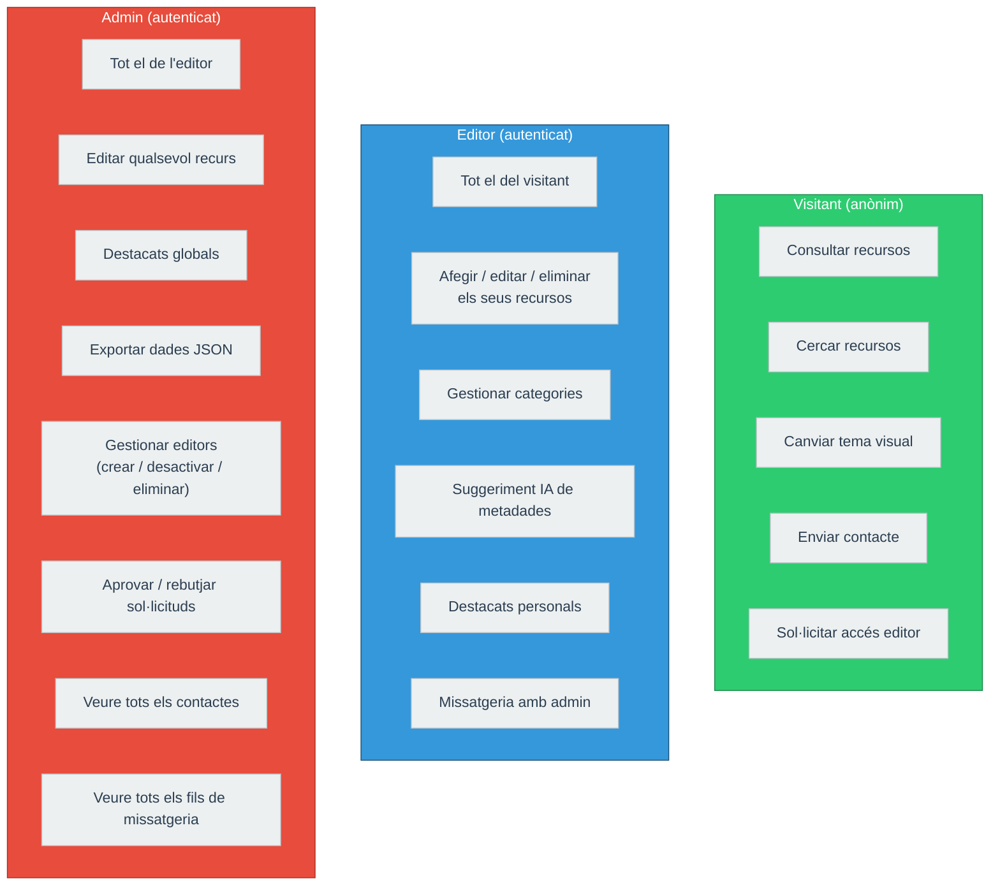
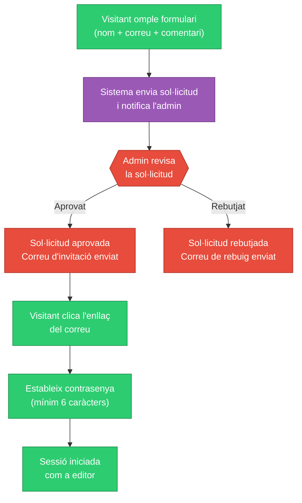
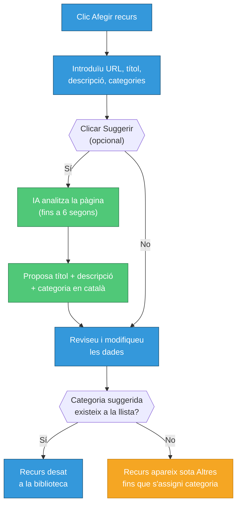

# Guia d'usuari — fp-recursos

**Versió**: 1.0  
**Data**: 2026-05-29  
**URL de l'aplicació**: `https://fp-recursos.masellas.info`

---

## Introducció

fp-recursos és una biblioteca curada de recursos educatius per a docents de Formació Professional (mòdul SSCE0110). L'aplicació organitza recursos web per categories i permet als editors afegir-hi nous continguts, enviar missatges a l'administrador i gestionar les seves col·leccions personals.

No cal registrar-se per consultar els recursos. Qualsevol persona pot navegar i cercar lliurement.

---

## Rols d'usuari

| Rol | Qui és | Què pot fer |
|-----|--------|-------------|
| **Visitant** | Qualsevol persona sense compte | Consultar i cercar recursos; enviar formulari de contacte; sol·licitar accés d'editor |
| **Editor** | Docent amb accés aprovat | Tot el que pot el visitant + afegir/editar/eliminar els seus propis recursos, gestionar categories, enviar missatges a l'admin, mantenir una llista de destacats personals |
| **Admin** | Administrador del sistema | Tot el que pot l'editor + gestionar tots els recursos i categories, aprovar/rebutjar sol·licituds d'editor, veure missatges i contactes, exportar dades |

El diagrama següent mostra quines funcionalitats té accés cada rol:

---

## Per a visitants

### Consultar recursos

Quan obriu `https://fp-recursos.masellas.info`, veieu immediatament la galeria pública de recursos. Els recursos estan organitzats per categories en una graella.

**Recursos nous**: Els recursos afegits des de la vostra darrera visita mostren la marca `★ NOU!` a la cantonada superior dreta de la targeta. Aquesta marca desapareix automàticament al cap de 100 dies.

**Navegació per categories**: La barra lateral esquerra mostra totes les categories. Cliqueu una categoria per filtrar la vista. La secció `DESTACAT` mostra els recursos que l'admin ha marcat com a rellevants.

### Cercar recursos

Cliqueu el botó `CERCAR` a la barra de navegació fixa. S'obre un camp de cerca. Escriviu qualsevol paraula; la cerca s'actualitza en temps real mentre escriviu.

La cerca es fa sobre el títol, la descripció i la URL del recurs (sense distinció de majúscules/minúscules). Per eliminar la cerca i tornar a la vista completa, cliqueu `Netejar cerca`.

### Canviar l'aparença (temes)

L'aplicació ofereix 5 temes visuals. La icona de paleta és sempre visible a la cantonada inferior dreta de la pantalla. Cliqueu-la per veure les opcions:

| Tema | Estil |
|------|-------|
| Brutal | Neubrutalist (taronja) — per defecte |
| Pastels 90s | Rosa pastel anys 90 |
| Wabi | Inspiració japonesa (verd) |
| Cyber | Cyberpunk neó |
| Corp | Corporatiu blau |

Passant el cursor per sobre d'un tema el previsualitzeu immediatament. Clicant-lo el confirmeu. El canvi és instantani, sense recàrrega de pàgina. L'elecció es desa al navegador i persisteix entre visites, però no se sincronitza entre dispositius.

### Contactar amb l'administrador

Si teniu preguntes o comentaris, cliqueu el botó de contacte a la capçalera. Ompliu el formulari (nom, correu electrònic i missatge) i envieu-lo. L'administrador rebrà una notificació.

### Sol·licitar accés d'editor

Si voleu contribuir recursos a la biblioteca, podeu sol·licitar accés d'editor:

1. Cliqueu `Accés` a la capçalera per anar a la pantalla d'inici de sessió.
2. Cliqueu `Encara no ets editor?`.
3. Ompliu el formulari: nom (obligatori), correu electrònic (obligatori) i comentari opcional explicant el vostre interès.
4. Envieu el formulari. Veureu la confirmació: *"Sol·licitud enviada! En breu l'admin revisarà la teva petició i rebràs una resposta per correu electrònic."*

No s'indica un termini de resposta. L'admin rebrà una notificació i resoldrà la sol·licitud manualment. Si s'aprova, rebreu un correu electrònic per establir la contrasenya.

---

## Per a editors

### Iniciar sessió

1. Cliqueu `Accés` a la capçalera.
2. Introduïu el vostre correu electrònic i contrasenya.
3. Cliqueu `Inicia sessió`.

Si heu oblidat la contrasenya, cliqueu `Has oblidat la contrasenya?`. Introduïu el vostre correu i cliqueu `Envia l'enllaç`. Si l'adreça existeix al sistema, rebreu un correu amb un enllaç de recuperació.

### Establir una contrasenya nova (invitació o recuperació)

Quan cliqueu un enllaç d'invitació o recuperació, l'aplicació obre automàticament un formulari per establir la contrasenya nova. Introduïu una contrasenya d'almenys 6 caràcters i confirmeu-la. Cliqueu `Establir contrasenya`. Un cop completat, la sessió s'inicia automàticament.

### Afegir un recurs

1. Assegureu-vos que heu iniciat sessió com a editor.
2. Cliqueu el botó `Afegir recurs` (visible a la vista d'editor).
3. S'obre el formulari de creació. Ompliu els camps:
   - **Títol** (obligatori)
   - **Descripció** (obligatòria)
   - **URL** (obligatòria)
   - **Categories** (seleccioneu una o més de la llista)
4. Podeu usar l'assistent d'IA per omplir el formulari automàticament: introduïu la URL i cliqueu `Suggerir`. L'IA analitzarà la pàgina i proposarà títol, descripció i categoria en català. Podeu acceptar les suggestions o modificar-les.
5. Cliqueu `Desar` per guardar el recurs.

**Nota sobre la IA**: Si la pàgina no és accessible o triga més de 6 segons a respondre, la IA intentarà generar metadades basant-se únicament en la URL. L'extensió Chrome dona fins a 30 segons per a la resposta de la IA.

**Nota sobre categories**: Si el formulari proposa una categoria que no existeix a la llista, el recurs es mostrarà sota `Altres` a la galeria pública.

### Editar un recurs

A la vista d'editor, cada recurs propi mostra una icona d'edició. Cliqueu-la per obrir el formulari d'edició amb les dades actuals preomplertes. Modifiqueu el que calgui i deseu.

Els editors només poden editar els seus propis recursos. L'admin pot editar qualsevol recurs.

### Eliminar un recurs

A la vista d'editor, cada recurs propi mostra una icona d'eliminació. Cliqueu-la per eliminar el recurs. L'acció és immediata i no es pot desfer.

### Gestionar categories

Els editors poden gestionar les categories des de la seva vista. Cliqueu la icona de gestió de categories per obrir el modal. Des d'aquí podeu:
- Crear una nova categoria (nom únic)
- Canviar el nom d'una categoria existent
- Eliminar una categoria

> **Important**: Si elimineu una categoria, els recursos que hi pertanyien no s'eliminaran, però apareixeran sota `Altres` a la galeria pública fins que se'ls assigni una categoria nova.

### Destacats personals

Com a editor, podeu mantenir una llista personal de recursos destacats, independent dels destacats globals que gestiona l'admin.

Per destacar un recurs: cliqueu la icona d'estrella a la targeta del recurs. El fons taronja indica que el recurs és a la vostra llista personal.

Per veure els vostres destacats: cliqueu `DESTACAT` a la barra lateral. La secció mostra els recursos de la vostra llista personal.

> **Nota**: Com a editor (no admin), la secció `DESTACAT` mostra la vostra llista personal, no els destacats globals. Els visitants i l'admin veuen els destacats globals (controlats per l'admin).

### Missatgeria

Podeu enviar missatges privats a l'administrador:

1. Cliqueu el botó `Missatges` a la capçalera. Un indicador numèric vermell apareix si teniu missatges no llegits.
2. S'obre el modal de missatgeria amb el fil de conversa.
3. Escriviu el missatge al camp inferior i envieu-lo.

**Restriccions de la missatgeria**:
- Només podeu comunicar-vos amb l'admin, no amb altres editors.
- Podeu editar o eliminar únicament el vostre **darrer missatge** enviat al fil.
- No hi ha límit de longitud de missatge.
- L'admin rep una notificació WhatsApp quan envieu un missatge.

Els missatges no llegits mostren un comptador al botó `Missatges`. El comptador s'actualitza automàticament.

### Modificar el perfil

Podeu canviar el vostre nom d'usuari des de la configuració del perfil. Cerqueu la icona de perfil o el menú de configuració a la capçalera.

---

## Per a l'administrador

L'admin disposa de totes les funcionalitats d'editor més les que es descriuen a continuació.

### Gestió de tots els recursos

L'admin pot editar i eliminar qualsevol recurs de qualsevol editor, no només els seus propis. A la vista pública, l'admin veu controls d'edició en totes les targetes.

L'admin controla els **destacats globals**: els recursos marcats amb l'estrella per l'admin apareixen a la secció `DESTACAT` per a tots els visitants i editors.

### Exportar dades

El botó `Exportar` (icona de descàrrega) apareix a la capçalera per a l'admin. Clicant-lo es descarrega un fitxer JSON amb tots els recursos:

- Nom del fitxer: `fp-recursos-backup-YYYY-MM-DD.json`
- Format: array JSON amb tots els camps de cada recurs
- No hi ha opció d'exportació en CSV

### Gestió d'editors (panell d'administració)

El panell d'administració mostra la llista de tots els editors. Des d'aquí podeu:

**Crear un editor directament**:
1. Cliqueu `Crear editor`.
2. Introduïu el correu, la contrasenya inicial i el nom d'usuari.
3. L'editor pot iniciar sessió immediatament amb l'email verificat.

**Desactivar un editor**:
Cliqueu el botó de desactivació al costat del perfil. L'editor no podrà iniciar sessió mentre estigui desactivat. La seva informació i recursos es conserven.

**Reactivar un editor**:
Cliqueu el botó de reactivació. L'editor rebrà un correu electrònic per restablir la contrasenya i podrà tornar a iniciar sessió.

**Eliminar un editor**:
Cliqueu el botó d'eliminació. Aquesta acció és permanent: s'elimina el compte d'`auth.users` i el perfil associat. Els recursos de l'editor eliminat podrien quedar orfes.

**Canviar la contrasenya d'un editor**:
Des del panell, podeu establir una contrasenya nova per a qualsevol editor.

### Sol·licituds d'accés d'editor

Quan un visitant envia una sol·licitud d'accés, apareix un comptador de notificació al panell. Cliqueu `Sol·licituds` per veure les pendents.

Per a cada sol·licitud podeu:
- **Aprovar**: S'envia un correu d'invitació a l'adreça indicada (usuari nou) o un correu de reactivació (si l'adreça ja existia al sistema).
- **Rebutjar**: S'envia un correu de notificació de rebuig.

### Gestió de contactes

Els missatges enviats pels visitants a través del formulari de contacte apareixen a la secció `Contactes` del panell d'administració. Podeu marcar-los com a llegits. Un comptador indica els no llegits.

### Missatgeria com a admin

Com a admin, el modal de missatgeria mostra tots els fils de conversa agrupats per editor. Podeu llegir i respondre a cada fil. Podeu editar o eliminar qualsevol dels vostres propis missatges enviats (en qualsevol posició del fil, no sols l'últim).

---

## Extensió Chrome

L'extensió Chrome permet desar recursos directament des de qualsevol pestanya del navegador sense obrir l'aplicació web.

### Instal·lar l'extensió

L'extensió es distribueix en dues modalitats:
- **Carrega descomprimida**: carregant la carpeta `extension/dist/` a `chrome://extensions` (mode desenvolupador).
- **Chrome Web Store**: si s'ha publicat, instal·lació estàndard des de la botiga.

### Iniciar sessió a l'extensió

L'extensió manté una sessió independent de l'aplicació web. La primera vegada que cliqueu la icona de l'extensió, veureu un formulari d'inici de sessió. Introduïu el correu i contrasenya d'editor. La sessió es desa al dispositiu i persisteix entre visites.

### Desar la pàgina actual

1. Cliqueu la icona de l'extensió a la barra d'eines de Chrome.
2. L'extensió llegeix automàticament el títol, la descripció i la URL de la pàgina actual.
3. Reviseu o modifiqueu les dades preomplertes.
4. Seleccioneu una o més categories.
5. Opcionalment cliqueu `Suggerir` perquè la IA proposi metadades.
6. Cliqueu `Desar`. L'extensió comprova si la URL ja existeix i avisa si és un duplicat.

**Límit de títol**: El títol no pot superar 80 caràcters (l'extensió ho indica).

### Desar múltiples pestanyes (mode gestor de pestanyes)

L'extensió té un mode de gestió de pestanyes que mostra totes les pestanyes obertes a la finestra actual:

1. Obriu l'extensió (sense clicar des d'una pàgina específica, o usant el mode de pestanyes).
2. La llista mostra totes les pestanyes obertes, agrupades per grup de pestanyes si n'hi ha.
3. Seleccioneu les pestanyes que voleu desar (podeu seleccionar-les totes amb `Seleccionar tot`).
4. Opcionalment cliqueu `Categoritzar amb IA` per generar metadades de totes les seleccionades automàticament.
5. Reviseu les dades de cada pestanya.
6. Cliqueu `Desar tot` per desar les seleccionades en bloc. Cada pestanya mostra l'estat: `pendent`, `desant`, `desat` o `error`.

---

## Preguntes freqüents

**No he rebut el correu d'invitació. Què faig?**  
Comproveu la carpeta de correu no desitjat. El correu s'envia des de `noreply@masellas.info`. Si no el trobeu, contacteu l'administrador per demanar una reactivació.

**Puc editar un recurs que ha afegit un altre editor?**  
No, si sou editor. Només podeu editar els vostres propis recursos. L'admin pot editar qualsevol recurs.

**El suggeriment de la IA ha proposat una categoria que no existeix. Què passa?**  
Si deseu el recurs amb una categoria que no existeix a la llista, apareixerà sota `Altres` a la galeria pública. Creeu primer la categoria o seleccioneu-ne una d'existent.

**El canvi de tema es perd quan torno a visitar la pàgina?**  
No, el tema es desa al navegador (localStorage) i persisteix entre visites. No se sincronitza entre dispositius: cada dispositiu recorda la seva pròpia elecció.

**Com sé si hi ha recursos nous des de la meva última visita?**  
Els recursos afegits des de la vostra última visita mostren la marca `★ NOU!`. Aquesta marca es calcula comparant la data de creació del recurs amb l'hora de la vostra visita anterior, emmagatzemada al navegador.

**Puc enviar missatges a altres editors?**  
No. La missatgeria és exclusivament entre editors i l'admin. No hi ha comunicació directa entre editors.

**Puc recuperar un recurs eliminat?**  
No. L'eliminació de recursos és permanent i no es pot desfer des de l'aplicació.
